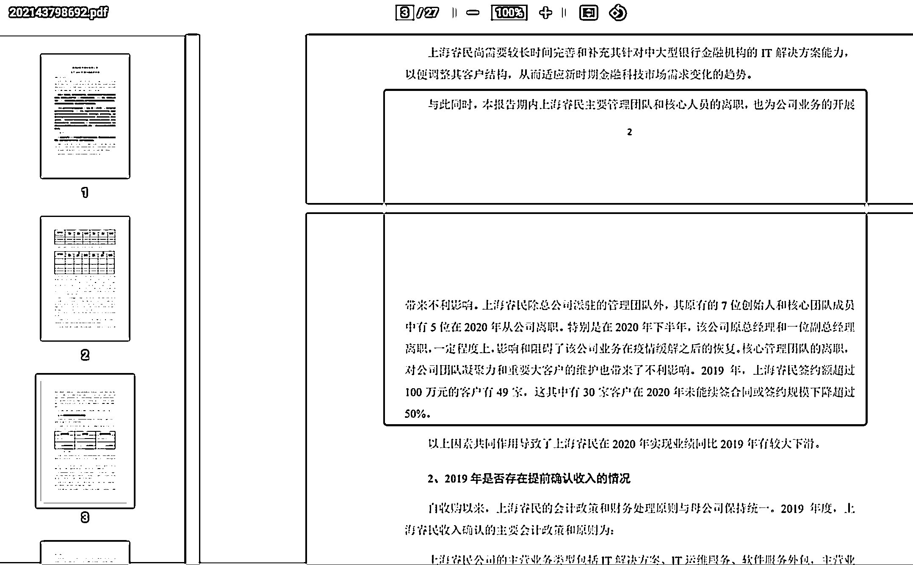

# 要了解一家公司，可以翻他的财报，看商业模式

> 原文：[`www.yuque.com/for_lazy/xkrm14/athcp7wgl3qskbf0`](https://www.yuque.com/for_lazy/xkrm14/athcp7wgl3qskbf0)

作者： 玉米 

日期：2023-02-27 

点赞数：14 

正文： 

要了解一家公司，可以翻他的财报，看商业模式，这里描述的一定是最准确的。 并且挖掘这个公司业务相关的一系列专业词汇。 能细到什么程度？ 具体人员离职都有写。 

 

 

评论区： 

暂无评论 

