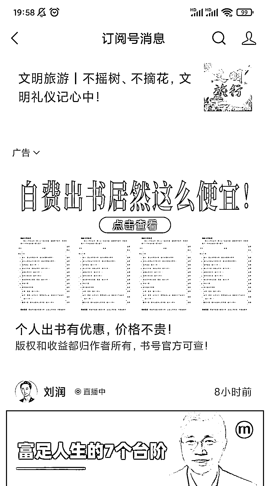
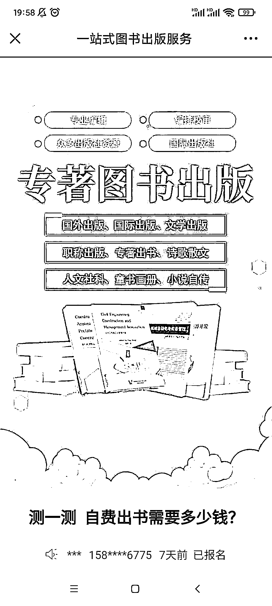

# 公众号投放自费出书广告

> 原文：[`www.yuque.com/for_lazy/xkrm14/ma5sxmqgh5u6k7ey`](https://www.yuque.com/for_lazy/xkrm14/ma5sxmqgh5u6k7ey)

作者： 阿黎 

日期：2023-03-02 

点赞数：32 

正文： 

自费出书，有书号。刷到好几次投放了，很多 oldmoney 有出书的自我满足需求，然后有些做社群的，训练营的，也会有需求，也适合出本书，然后发给社团成员。 

 

 

 

 

评论区： 

暂无评论 

