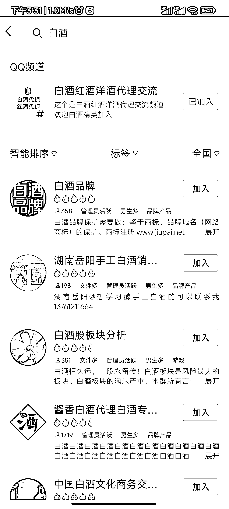
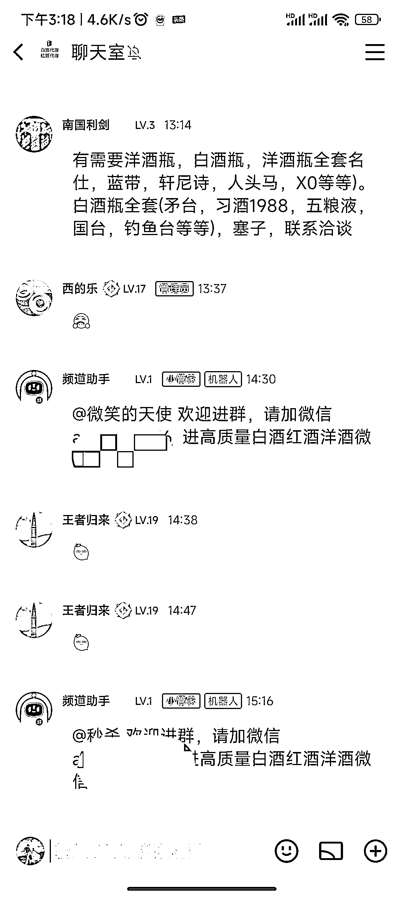

# QQ 频道截流玩法

> 原文：[`www.yuque.com/for_lazy/xkrm14/tp95a3dcbtgrh81z`](https://www.yuque.com/for_lazy/xkrm14/tp95a3dcbtgrh81z)

<ne-p id="u9ed25655" data-lake-id="u9ed25655"><ne-text id="uca254d22">作者： 易小北</ne-text></ne-p> <ne-p id="u94a068bc" data-lake-id="u94a068bc"><ne-text id="uc210df92">日期：2023-03-02</ne-text></ne-p> <ne-p id="uaf6fff4f" data-lake-id="uaf6fff4f"><ne-text id="u644da9c5">点赞数：</ne-text><ne-text id="uf8de1531" ne-bold="true">21</ne-text></ne-p> <ne-hole id="u6f928c20" data-lake-id="u6f928c20"><ne-card data-card-name="hr" data-card-type="block" id="iCFuk" data-event-boundary="card"><ne-p id="u50df9867" data-lake-id="u50df9867"><ne-text id="u75500aa6">正文：</ne-text></ne-p> <ne-p id="uc3bd6287" data-lake-id="uc3bd6287"><ne-text id="u129f10af">QQ 频道截流玩法 前三张图作为参考数据，通过 QQ 群，搜索白酒，红酒，洋酒，都排第一，</ne-text> <ne-text id="u343d88ce">QQ 频道正常情况可以显示 3 个频道列表，如果截流，可以跟第一个频道群，设置相同的词，直接排名第二，当然可以刷活跃度冲击第一的位置，</ne-text> <ne-text id="udd2287d3">还有一种就是做没人做的词，无人竞争，安全感第一 或者直接 3 个频道霸占前三位置 图 4 是我加进频道别人的引流方案</ne-text></ne-p> <ne-p id="u2a64fa57" data-lake-id="u2a64fa57"><ne-card data-card-name="image" data-card-type="inline" id="jFzSL" data-event-boundary="card"></ne-card></ne-p> <ne-p id="u4451c311" data-lake-id="u4451c311"><ne-card data-card-name="image" data-card-type="inline" id="lb98w" data-event-boundary="card"></ne-card></ne-p> <ne-p id="uf1d7bf69" data-lake-id="uf1d7bf69"><ne-card data-card-name="image" data-card-type="inline" id="ILrCE" data-event-boundary="card"></ne-card></ne-p> <ne-p id="ude2cd292" data-lake-id="ude2cd292"><ne-card data-card-name="image" data-card-type="inline" id="Jjtdi" data-event-boundary="card"></ne-card></ne-p> <ne-hole id="ub7a0e7ef" data-lake-id="ub7a0e7ef"><ne-card data-card-name="hr" data-card-type="block" id="WNkbF" data-event-boundary="card"><ne-p id="u73c27260" data-lake-id="u73c27260"><ne-text id="ub6c2edac">评论区：</ne-text></ne-p> <ne-p id="u29ee5b16" data-lake-id="u29ee5b16"><ne-text id="u810de598">老牛（深圳➕云南） : 有相应的技术实现霸屏吗?</ne-text></ne-p> <ne-p id="u7d4bcf94" data-lake-id="u7d4bcf94"><ne-text id="u7424ce7a">易小北 : 有技巧，没有技术</ne-text></ne-p> <ne-hole id="u7b93eaac" data-lake-id="u7b93eaac"><ne-card data-card-name="hr" data-card-type="block" id="fG25r" data-event-boundary="card"><ne-p id="u65a90dc6" data-lake-id="u65a90dc6"><ne-text id="uaa0746b9">公众号懒人找资源，懒人专属群分享</ne-text></ne-p></ne-card></ne-hole></ne-card></ne-hole></ne-card></ne-hole>