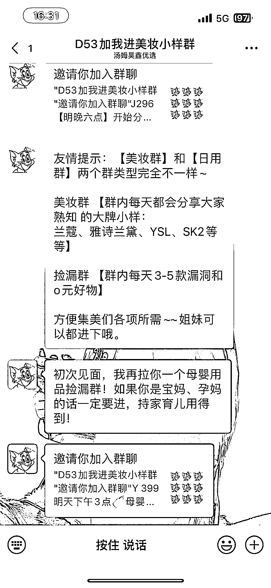

# 朋友圈投放撸小样广告，引流微信群变现

> 原文：[`www.yuque.com/for_lazy/xkrm14/dcet9z8h8rbwft79`](https://www.yuque.com/for_lazy/xkrm14/dcet9z8h8rbwft79)

<ne-p id="uce6cad37" data-lake-id="uce6cad37"><ne-text id="u2030e358">作者： lalalaLiz</ne-text></ne-p> <ne-p id="u35213810" data-lake-id="u35213810"><ne-text id="u0b34f294">日期：2023-03-01</ne-text></ne-p> <ne-p id="u5171b421" data-lake-id="u5171b421"><ne-text id="u832be4d8">点赞数：</ne-text><ne-text id="ue7b3f74a" ne-bold="true">20</ne-text></ne-p> <ne-hole id="u7b9687b9" data-lake-id="u7b9687b9"><ne-card data-card-name="hr" data-card-type="block" id="Tz7Ex" data-event-boundary="card"><ne-p id="u6d6c5d86" data-lake-id="u6d6c5d86"><ne-text id="u3caa2aca">正文：</ne-text></ne-p> <ne-p id="u0bb33f16" data-lake-id="u0bb33f16"><ne-text id="u79522e28">撸美妆小样 引流: 朋友圈广告投放短视频，我进了群观察了一下，大概半个小时可以引流接近五百人，速度非常快 产品:</ne-text> <ne-text id="u733d9b0c">宣传文案提到是品牌官方旗舰店直接发货，打消大家对于小样是否是正品的疑虑，大概看了一下，基本都是带“天猫 U 先”标识的品牌会员礼，应该本来自己去加入品牌会员就可以购买的</ne-text> <ne-text id="u77ecb129">变现: 应该也是淘宝客变现为主</ne-text></ne-p> <ne-p id="uab8e4871" data-lake-id="uab8e4871"><ne-card data-card-name="image" data-card-type="inline" id="gY7q3" data-event-boundary="card">  <ne-p id="u92fedbd9" data-lake-id="u92fedbd9"><ne-card data-card-name="image" data-card-type="inline" id="gkK6q" data-event-boundary="card">  <ne-hole id="u760c446d" data-lake-id="u760c446d"><ne-card data-card-name="hr" data-card-type="block" id="cBYMG" data-event-boundary="card"><ne-p id="uc1831e50" data-lake-id="uc1831e50"><ne-text id="u85873078">评论区：</ne-text></ne-p> <ne-p id="ua4211d92" data-lake-id="ua4211d92"><ne-text id="u954ed7cc">明月几时有 : 小红书也可以鲁小样</ne-text></ne-p> <ne-hole id="u754521b7" data-lake-id="u754521b7"><ne-card data-card-name="hr" data-card-type="block" id="dSfO3" data-event-boundary="card"><ne-p id="u358acc2c" data-lake-id="u358acc2c"><ne-text id="uc78f54a3">公众号懒人找资源，懒人专属群分享</ne-text></ne-p></ne-card></ne-hole></ne-card></ne-hole></ne-card></ne-p></ne-card></ne-p></ne-card></ne-hole>