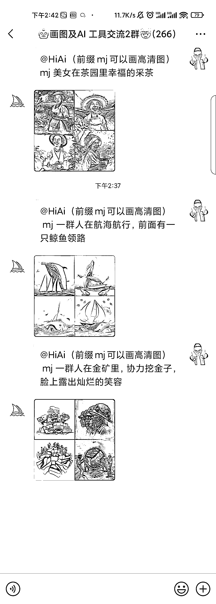
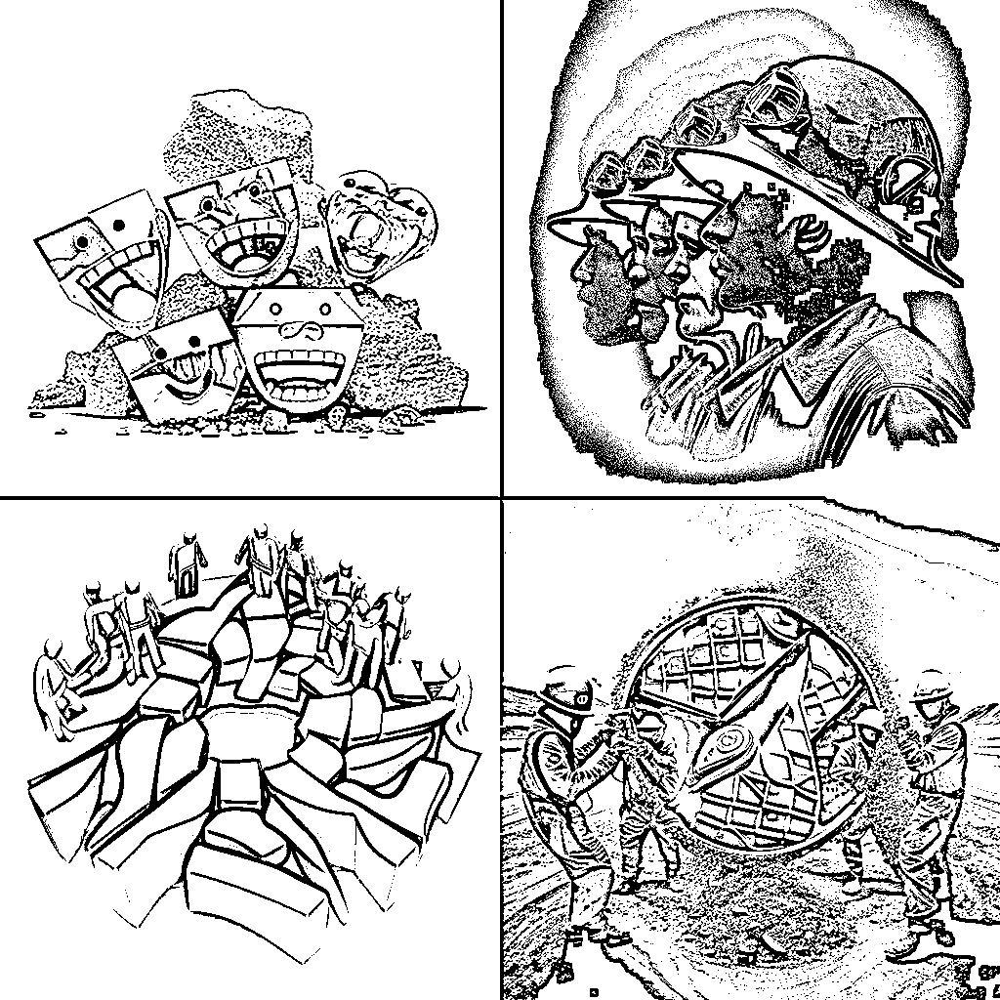

# 微信 AI 落地到细分领域场景，接入不同赛道服务号，付费提供服务

> 原文：[`www.yuque.com/for_lazy/xkrm14/pus595tbr3iiwvp4`](https://www.yuque.com/for_lazy/xkrm14/pus595tbr3iiwvp4)

作者： 🍀刘驴💥 

日期：2023-02-28 

点赞数：24 

正文： 

AI 绘画直接接入微信群，群内按规定给出描述词，出画效果很快，但是质量还不太行。 和群主聊了下，目前对方还没具体变现，后续会开发网页，帮用户搭建进微信群、公众号等。 不过我提供个思路，把 AI 落地到各大细分领域场景里，接入进不同细分赛道服务号，付费提供该领域服务。 

  

  

  

  

评论区： 

王大诗 : 方便加个微信再聊聊吗 

🍀刘驴💥 : LLDXX221 

