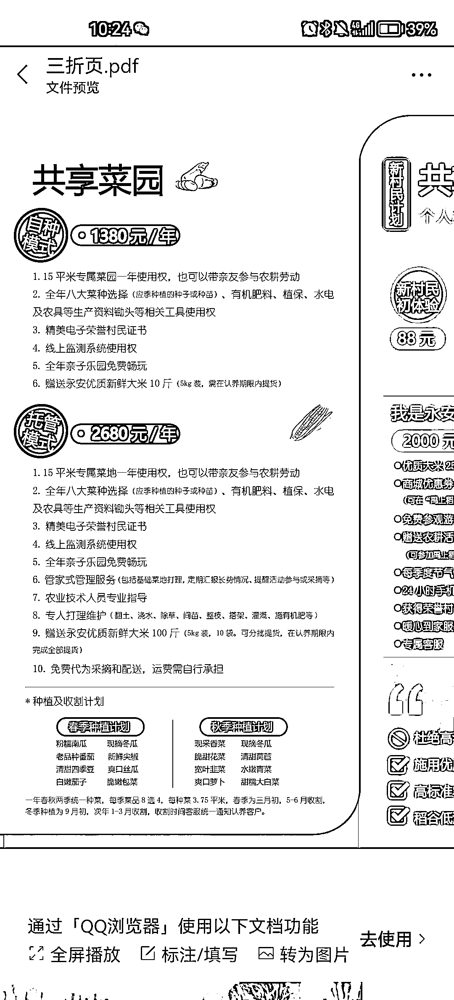

# 共享菜园，云种菜

> 原文：[`www.yuque.com/for_lazy/xkrm14/egofzcn3tf05w7tu`](https://www.yuque.com/for_lazy/xkrm14/egofzcn3tf05w7tu)

作者： Gundy 

日期：2023-03-03 

点赞数：54 

正文： 

共享菜园，很有意思的玩法 

 

评论区： 

大江 : 共享经济模式下，很多产品都可以做。菜园的确有意思，可以专门针对高消费人群做大型农家乐，延展做聚餐，每月定期可以来吃自己菜地的到菜，带孩子来体验“农村生活”。 

鱼 : 现在做这个的农场很多 上周去了一个农场 也有在弄共享菜园，还有领养一只土鸡，每个月有土鸡蛋；领养一颗桃树，每年保底 30 斤桃子+100g 桃胶 

Gundy : 真不错 

才 : 我家有地，也想搞这样的，之前就这样的想法，但我们这个地方是 5 线小城市，不知道有没有这样的高端用户 

九帆 : 可以尝试从线上寻找高端用户 

Gundy : 感兴趣的可以去看下公众号稻香永安。杭州余杭一个村子，也在我家这不远的地方 

