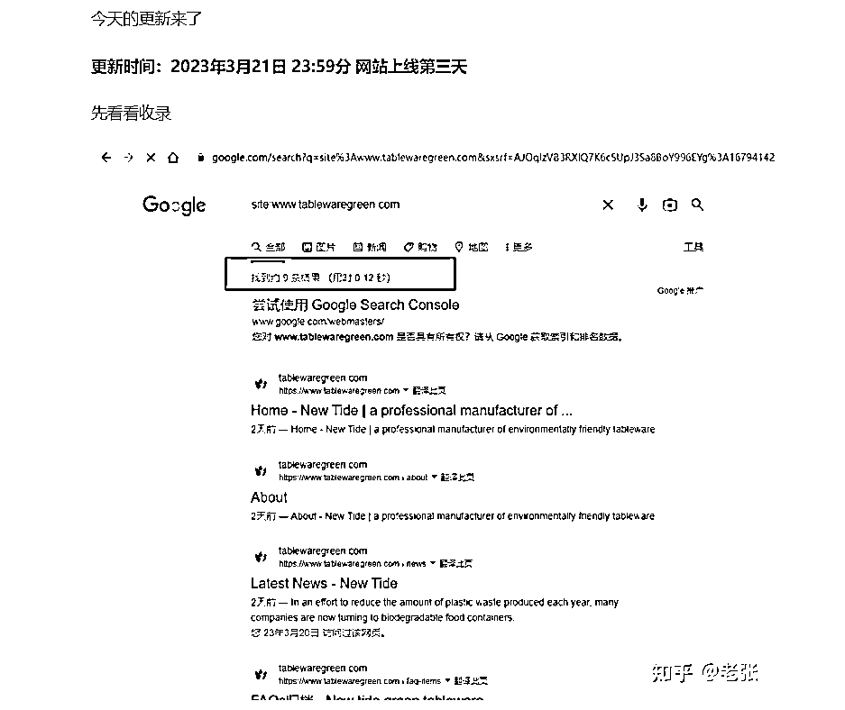
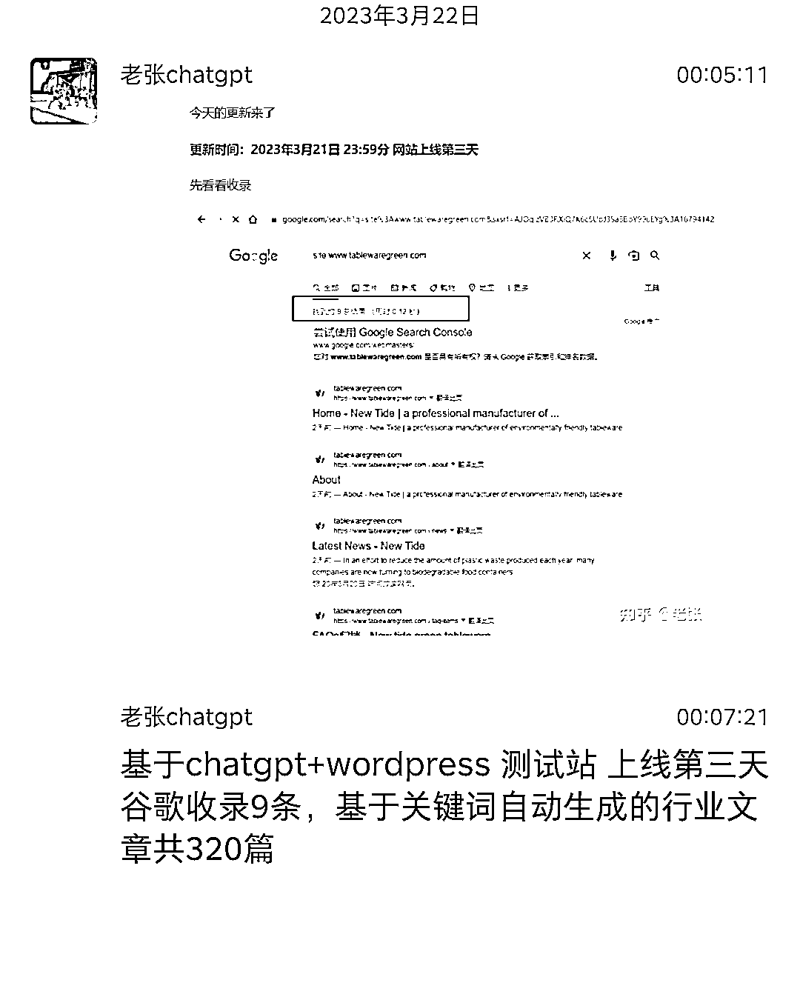

# AI 应用 Chatgpt + Wordpress 测试站，基于关键词自动生成的行业文章

> 原文：[`www.yuque.com/for_lazy/xkrm14/mv263xg8ganppsy7`](https://www.yuque.com/for_lazy/xkrm14/mv263xg8ganppsy7)

作者： 何轩

日期：2023-03-22

点赞数：13

正文：

AI 应用 基于 chatgpt+wordpress 测试站 上线第三天 谷歌收录 9 条，基于关键词自动生成的行业文章共 320 篇

评论区：

良辰美 : 收录后也要看网站流量的增长情况吧

