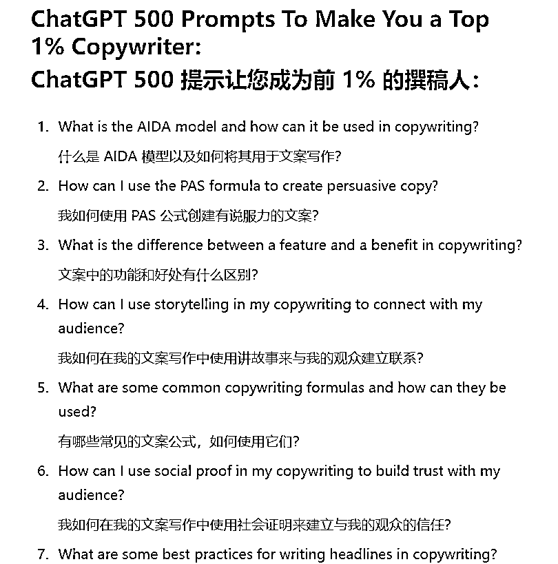

# ChatGPT 500 提示让您成为前 1% 的撰稿人

> 原文：[`www.yuque.com/for_lazy/xkrm14/qmkrksnbrdglwtqo`](https://www.yuque.com/for_lazy/xkrm14/qmkrksnbrdglwtqo)

作者： 老黄牛

日期：2023-03-22

点赞数：42

正文：

500 个对创作者有帮助的 Prompts(提示) 原标题：ChatGPT 500 提示让您成为前 1% 的撰稿人 地址：Login+|+InCareer top-1-copywriter-alexis-khvatov-/)

评论区：

蛤蟆先生 : 页面不存在了

老黄牛 : 在的，要科学上网

蛤蟆先生 : 我开了全局也看不到[捂脸]

向上的塔皮 : 这个有人在 Gumroad 卖 47 美元

老黄牛 : 卖这 500 个提示？

老黄牛 : 注册领英了吗？

向上的塔皮 : 对的。看介绍前面的问题一模一样的

老黄牛 : 好的，谢谢分享信息

