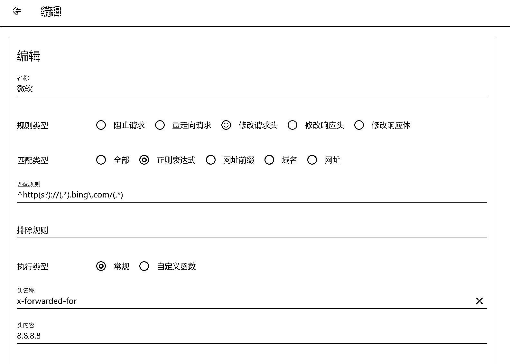
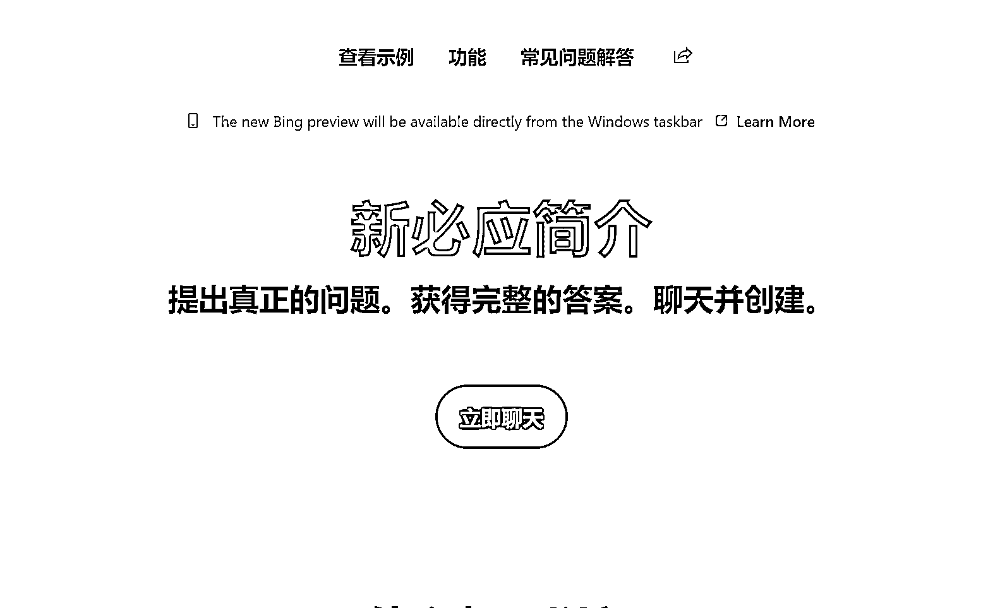

# 微软 Bing，不用梯子就可以在 Chrome 浏览器使用

> 原文：[`www.yuque.com/for_lazy/xkrm14/rtfv3g1hnspaeaeu`](https://www.yuque.com/for_lazy/xkrm14/rtfv3g1hnspaeaeu)

作者： 代码君

日期：2023-03-21

点赞数：14

正文：

微软 bing，把请求头修改一下，不用梯子，就可以在 chrome 浏览器使用 微软 chatgpt new bing 修改请求头 ^http(s?)://(.).bing\.com/(.) x-forwarded-for 8.8.8.8 user-agent Mozilla/5.0 (X11; Linux x86_64) AppleWebKit/537.36 (KHTML, like Gecko) Chrome/110.0.0.0 Safari/537.36 Edg/110.0.1587.41

  

  

  

评论区：

康松 : 现在这招还有用嘛，之前我试过一直 Ref A/B/C 错误

