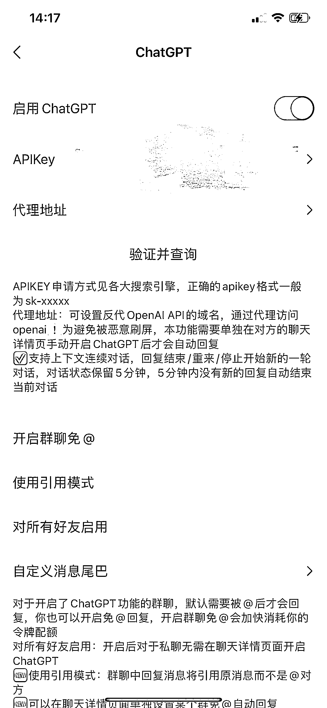

# 自带 ChatGPT 插件的微信版本

> 原文：[`www.yuque.com/for_lazy/xkrm14/wi6vk3e73mu4iswf`](https://www.yuque.com/for_lazy/xkrm14/wi6vk3e73mu4iswf)

作者： 白露听雨

日期：2023-03-20

点赞数：16

正文：

自带 chatgpt 插件的微信版本，配合签名，自行安装，算是小白微信接入 chatgpt 比较方便的方法 签名方法 插件微信版本 链接: 提取码: f5f4[https://t.zsxq.com/0crQQ79lb](https://t.zsxq.com/0crQQ79lb) [百度网盘+请输入提取码](https://pan.baidu.com/s/1jY-fEwcvNCU_CvJFXZ_6Lw?pwd=f5f4)

评论区：

浅色 8ug 的喵 : 给不太懂的圈友一个温馨提示： 1、需要网络环境或返代链接。 2、新号和最近有违规的号尽量不要用，有封号几率。

