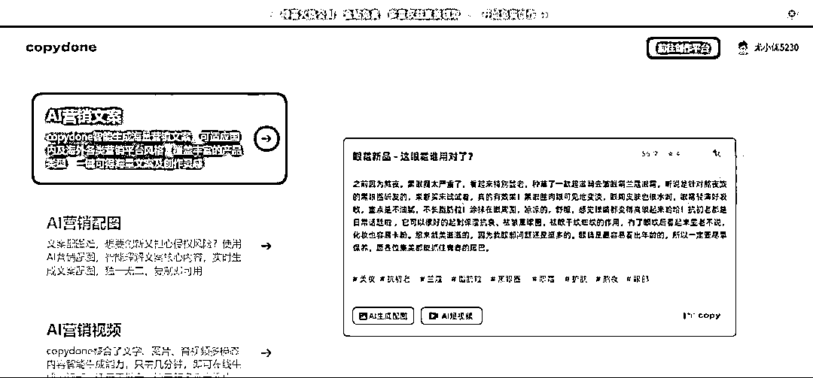

# 免费的 AI 智能写作工具

> 原文：[`www.yuque.com/for_lazy/xkrm14/ni260e7c5d4sc7hg`](https://www.yuque.com/for_lazy/xkrm14/ni260e7c5d4sc7hg)

作者： 波本零

日期：2023-03-20

点赞数：20

正文：

给大家推荐一款国内免费的 AI 智能写作工具 copydone 网址： 可用于不同场景营销文案的生成，既能提供包括知乎、小红书、今日头条等主流平台营销内容的生成，也能为特定产品比如面膜、面霜、化妆水等 15+商品生成专属文案。 在营销内容生成上，不仅可以生成文案，还可以一键生成专属的营销配图与短视频，满足我们的内容在多平台分发。 copydone 除了生成服务外，额外基于深度营销创作用户，提供的超强大的智能聚合与编辑功能，一键插入与智能辅写编辑，不仅能满足核心在线写作服务，同时借助于智能续写、润色、扩写与精炼、SEO 改写等多 AI 化辅助创作，让我们的营销内容生成更加无负担。 [AIGC 原创文案写作神器，营销内容-快文 CopyDone，copyai.cn](https://copyai.cn/?share_code=435447) [AIGC 原创文案写作神器，营销内容-快文 CopyDone，copyai.cn](https://h5.copyai.cn/?share_code=435447#/)

评论区：

暂无评论

