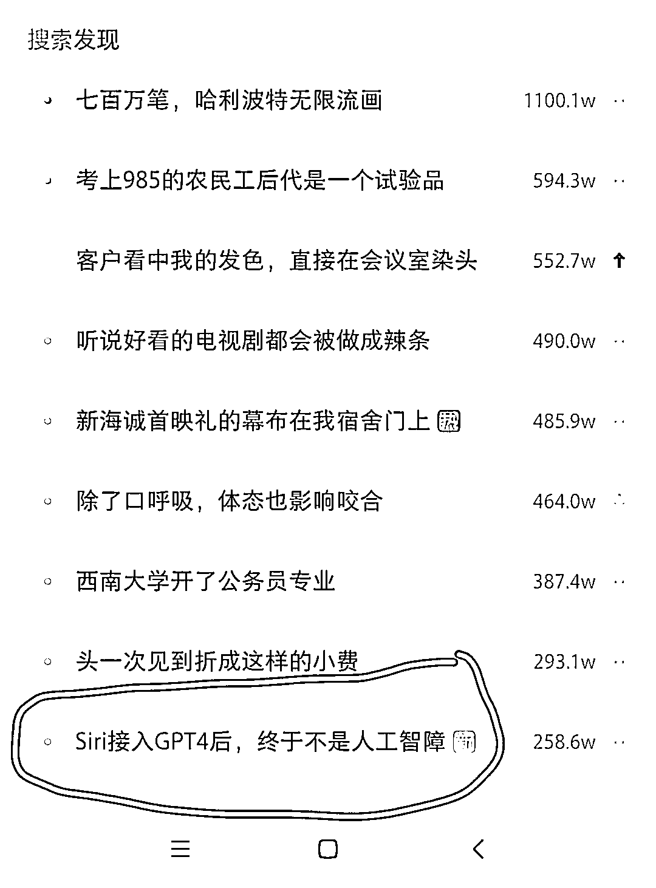

# 整合 ChatGPT 和小爱同学，SIRI 等语音助手交互的操作

> 原文：[`www.yuque.com/for_lazy/xkrm14/pfpch56rz6l7il1v`](https://www.yuque.com/for_lazy/xkrm14/pfpch56rz6l7il1v)

作者： 阿黎

日期：2023-03-20

点赞数：16

正文：

整合 chatGPT 和小爱同学，SIRI 等 语音助手交互的操作，然后到淘宝闲鱼上，卖教程或者代操作，也可以做为引流资料，引流到 chatgpt 社群 图 3 周日晚刷到，Siri 接入 ChatGPT4 话题，小红书上热度在增长 [不用+root+使用小爱同学和+ChatGPT+交互折腾记+·+Issue+#258+·+yihon...](https://github.com/yihong0618/gitblog/issues/258)

  

  

  

评论区：

HEXIN : 周末就想要这么个东西

