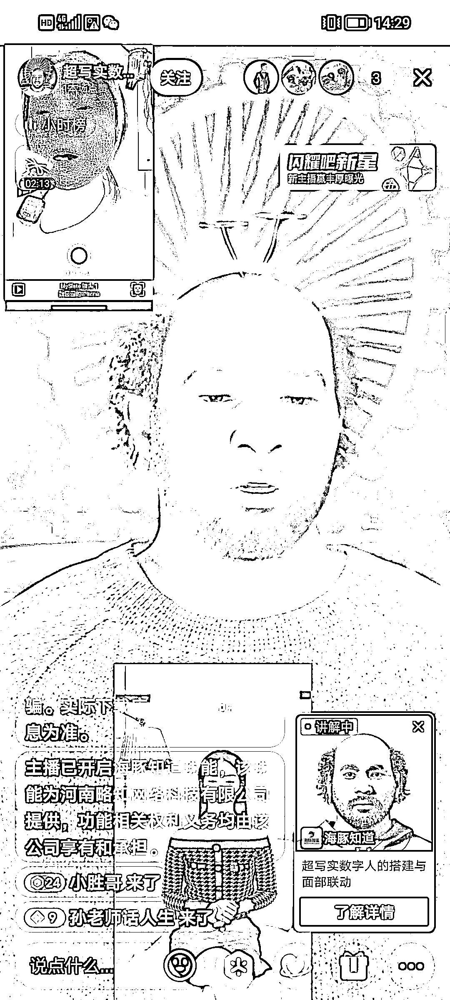

# 抖音数字人直播教学

> 原文：[`www.yuque.com/for_lazy/xkrm14/dmbyklf9bl098by6`](https://www.yuque.com/for_lazy/xkrm14/dmbyklf9bl098by6)

作者： 朱胜

日期：2023-03-21

点赞数：50

正文：

抖音上有数字人直播教学 针对小白且对数字虚拟人感兴趣的 199 元课程，总共 5 节课 课程大纲： 1、数字人运行平台的安装与环境搭建 2、数字人平台的注册与技巧 3、数字人的导入与面部联动 4、数字人场景的获取及运用 5、直播伴侣捕获数字人画面教程 虚拟人的三大特征：真实的人物形象；会思考、会表达；能与人真实的感知互动 应用场景： 1、游戏：玩家数字化身需求日益提升，头部游戏厂商具有数字人技术积累 2、偶像造星：虚拟偶像逐步渗透主流文化，国内大厂纷纷入局虚拟艺人 3、品牌营销：虚拟代言大幅提升用户吸引效率，外部运营快速引导商业流量 4、社交：数字人为次世代社交的必要环节，增强用户沉浸及交互体验 5、影视：动作捕捉技术推动影视虚拟形象创作，打开艺术创作想象空间

  

  

  

评论区：

Luke 王子 : 还涨价了，我之前看这个直播间是 59.9[呲牙]

朱胜 : 供不应求

大理阿彬 : 请问数字人平台大概是什么价位？

