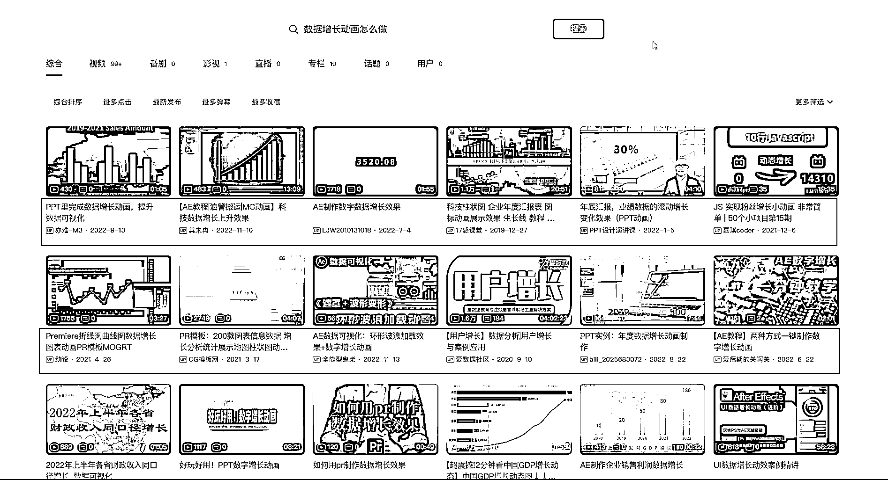

# 花火数图 Hanabi-在线数据短视频工具

> 原文：[`www.yuque.com/for_lazy/xkrm14/qvscz466mp1n4tuv`](https://www.yuque.com/for_lazy/xkrm14/qvscz466mp1n4tuv)

作者： 常常

日期：2023-03-21

点赞数：36

正文：

一款在线数据可视化制作神器推荐，四步完成数据动态图！ 分享一个非常棒的工具，实测证明确实可以套利 我在制作自己小红书粉丝数据随着时间增长变化时，发现想要制作一个视频，需要进行使用 AE 模板， 在 B 站、小红书上搜索了很多办法，都没有一个可以直接输入数据，自动生成视频的模式 后来想到了数据可视化的办法，终于找到了国内一家靠谱的网站，导入数据，一键生成数据视频： 花火数图 到了这一步，其实已经可以是一个生意了，在淘宝、闲鱼上帮助别人做动态的数据视频或者数据 GIF，自己不用模板，直接一键生成。 第二个价值点在于信息差的利用： 花火数图是一个专门做数据动态可视化的网站，提供了大量的数据可视化模板，可以直接使用，但是需要付费会员，会员价格还不便宜，如果只是使用一次很不方便，却付了几十元，多少有些麻烦。 所以，在闲鱼上搜索，还真的找到了一些卖家，1.5 可以用 5 天，很划算，但是到付款时发现，这 5 天是好友邀请，只要你是用户，邀请一个新人，双方就可以互相收到 5 天的会员体验，真的是没想到生意还可以这么做，可以既得了便宜，又赚到了钱， 这是我心中把信息差用到极致的例子，没有之一，哈哈。 这个风向标最大的价值，除了给各位圈友提供一个工具，解决一个实际问题，还是想用这个例子给看到的圈友一个启发，其他的软件也可以使用同样的办法。 [花火数图 Hanabi-在线数据短视频工具-数可视](https://hanabi.data-viz.cn/index?lang=zh-CN)

评论区：

暂无评论

