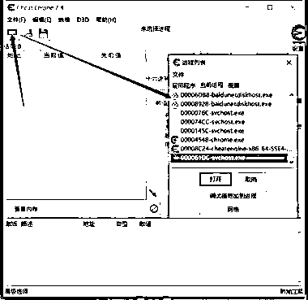
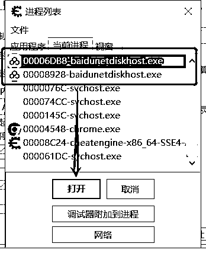
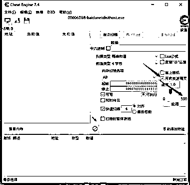

# 百度网盘不用开会员也能高速下载文件的方法

> 原文：[`www.yuque.com/for_lazy/xkrm14/wi3vh77tgi2ke1vz`](https://www.yuque.com/for_lazy/xkrm14/wi3vh77tgi2ke1vz)

作者： Mazc

日期：2023-03-20

点赞数：35

正文：

百度网盘不用开会员也能高速下载文件的方法： 需要工具：cheat Engine 7.4 方法： 1、打开百度网盘后，再打开 Cheat Engine 2、按图 1 打开进程列表，找到「baidunetdiskhost.exe」进程 3、打开其中一个，勾选「开启变速精灵」将速度来到 500，再点「应用」 4、修改后虽然显示速度还是每秒几十 k，但文件下载速度是每秒十几兆在跳（取决于自己的网络） ps：如果其中一个进程没作用，就改另一个，亲测有效

  

  

  

评论区：

天启 : 这个很有用

Mazc : 不知道能用多久了，抓紧用吧

天启 : 好的

