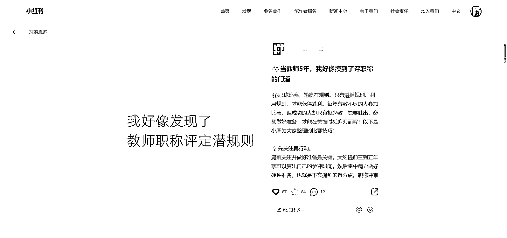
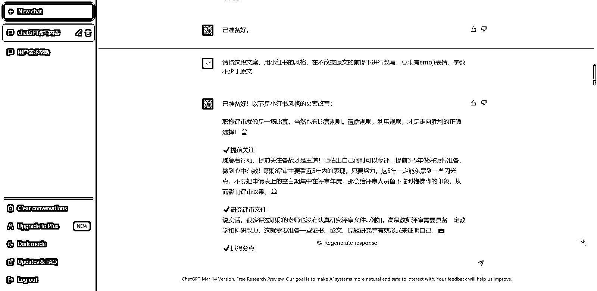
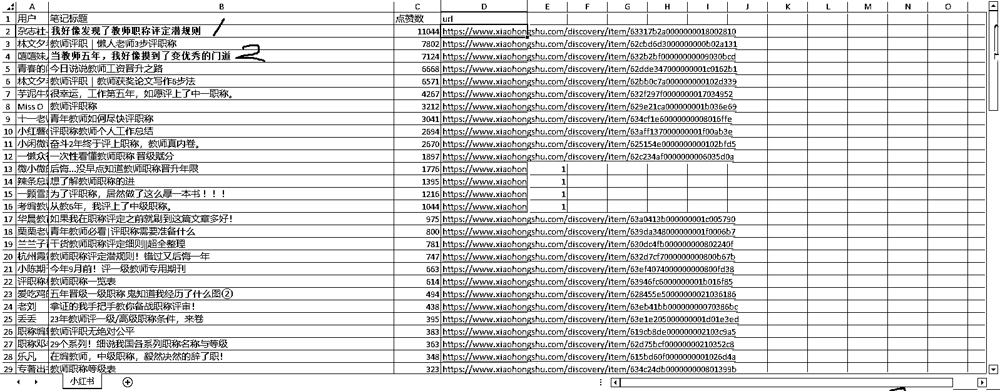
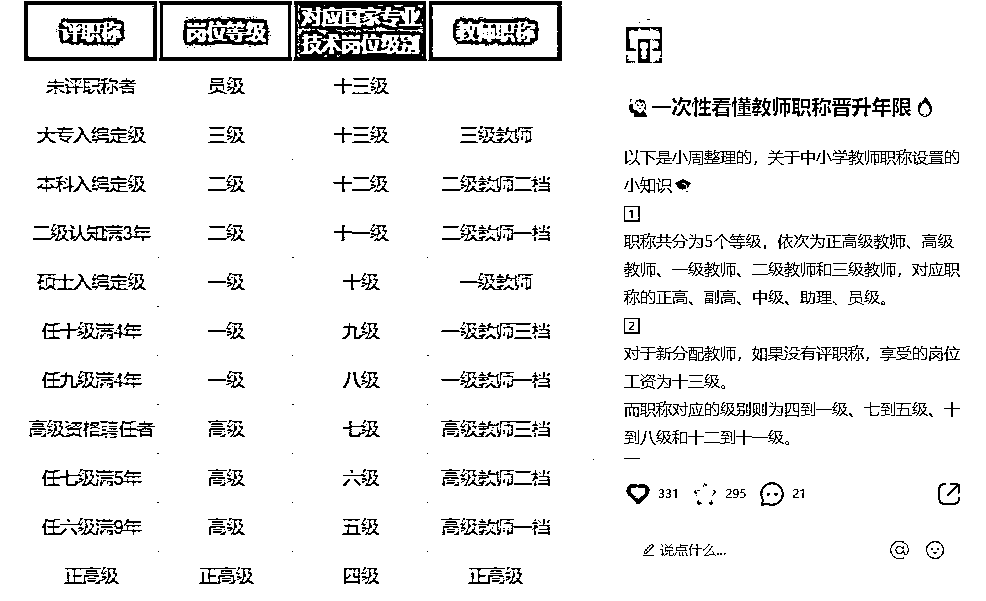
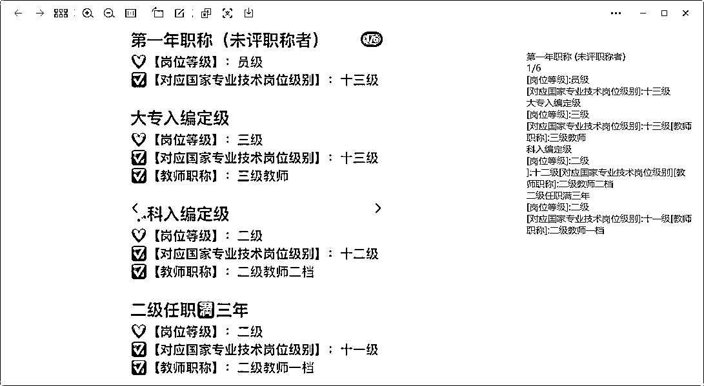
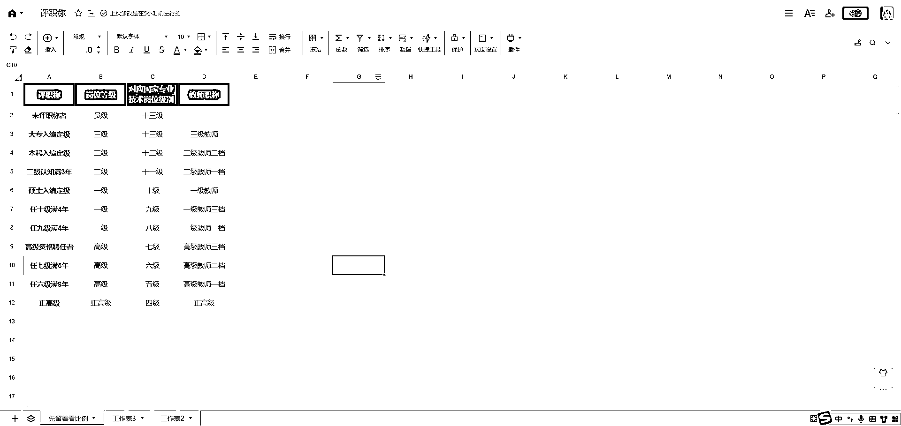

# 小红书两篇引流爆款笔记拆解

> 原文：[`www.yuque.com/for_lazy/xkrm14/ovevtotnaouukgi5`](https://www.yuque.com/for_lazy/xkrm14/ovevtotnaouukgi5)

作者： 老彭

日期：2023-03-22

点赞数：49

正文：

✅像素级拆解自己的两篇引流爆款笔记（图 1），小众领域算爆款，截图时比较早，现在点赞收藏各 100+了。 方法教给团队小伙伴们，马上也打造出一篇 1000+互动的笔记，在此之前的 7 个月他最高互动也就 200+。（个人感觉可以适用于绝大多数领域） 【文字篇】 1️⃣寻找领域爆款笔记 以「教师职称」关键词为例，用工具（小红书笔记批量下载软件）提取了这个关键词在小红书的爆款笔记，并按点赞数排序。（图 2） 2️⃣以第一篇爆款「我好像发现了教师职称评定潜规则」为例，直接提取了它的文案，复制（图 3） 3️⃣chatGPT+小红书 接下来我将你提供一段文案，请先阅读并进行分析，完成后回复已准备好，请等待我的下一步指令。下面是文案内容：xxx——爆款文案的复制粘贴（图 4） 4️⃣用 chatGPT 伪原创爆款文案 请将这段文案，按照小红书的风格，在不改变原意的前提下进行改写，要求有 emoji 表情，字数不少于原文（图 5） 5️⃣套用领域数据比较高的标题 我也试过用 chatGPT 取标题，但效果并不满意，最后还是相信数据（最靠谱），提取了两个合适的标题，第一个是「我好像发现了教师职称评定潜规则」， 因为原文是文案标题，所以我直接用于封面标题了，第二个是「当教师五年，我好像摸到了变优秀的门道」，稍微替换关键词用于文案标题。（图 6） ✅像素级拆解引流爆款之【图片篇】——（图 7） 1️⃣寻找领域爆款笔记 同上，以这篇「后悔没早点知道教师职称晋升年限」为例，用微信截图直接识别文字，提取文案（图 8） 2️⃣用腾讯文档表格（其他同类软件也行）制作成合集类笔记的封面（最容易出爆款的封面之一），大多数图片类笔记都可以切换成这种风格去展示（图 9） 3️⃣chatGPT+小红书 4️⃣用 chatGPT 伪原创爆款文案 5️⃣套用领域数据比较高的标题 剩下的 3-5，同上，就不重复叙述了，不过可以延伸一点，第二种方法可以用 ChatGPT 的精简/阐明/举例的指令，打造出一些纯原创的文案，用于笔记文案里（因为我们不是把主要内容整合进图片了吗，刚好需要一些新的内容） ✅好啦！就这么简简单单就完成一篇爆款选题的笔记制作啦！ （什么时候星球才可以图文并茂地写内容啊....太难了，不知道这么排版，亦仁大大会不会觉得烦就直接跳过了，现在风向标都可以评精华了，我还有点小期待的呢..）

评论区：

追鱼 : 求小红书批量下载笔记

小伙子 : 精华帖上有批量下载工具

📌小攀师兄 : 电脑可以图文一起

老彭 : 我就是电脑写的呀😭莫非可以直接复制进文本框？

📌小攀师兄 : 电脑有一个写文章，就像精华帖里面一样的

老彭 : 最新风向标帖子有写

老彭 : 小红书航海资料也有

追鱼 : 感谢感谢

