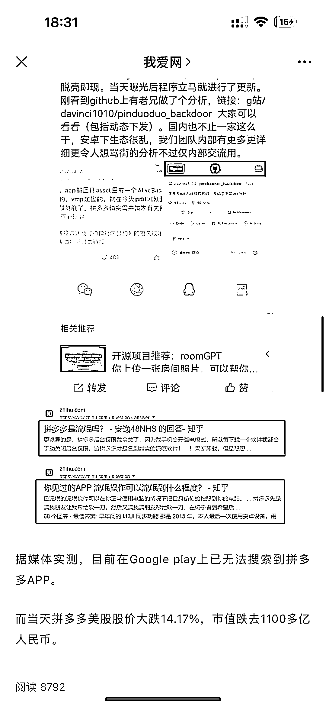

# 拼多多被谷歌下架了，股价下跌

> 原文：[`www.yuque.com/for_lazy/xkrm14/lbgkpu26wvoyskky`](https://www.yuque.com/for_lazy/xkrm14/lbgkpu26wvoyskky)

作者： 地表最强运营商 帅方

日期：2023-03-22

点赞数：25

正文：

拼多多被谷歌下架了 美股大跌 14.7% 我看完的第一反应居然是 “完了，拼多多商家这几天要被疯狂扣钱了”

评论区：

小花 : PDD 如果按国内的玩法，在国外要被封禁

陈小胖 : 没有哪个电商同行能容得下它，就知道内卷[偷笑]

Darren : 人家急了而已，逆向思维才能赚钱，布局 pdd 美股的好时机

