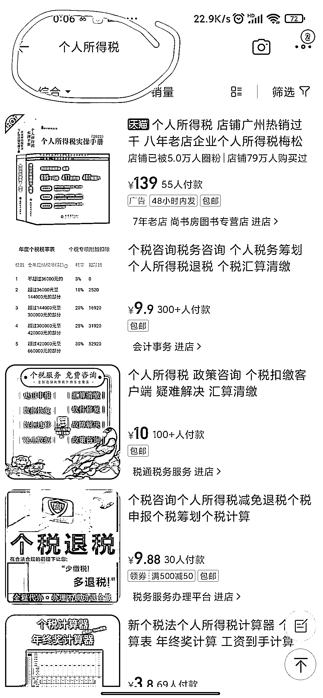
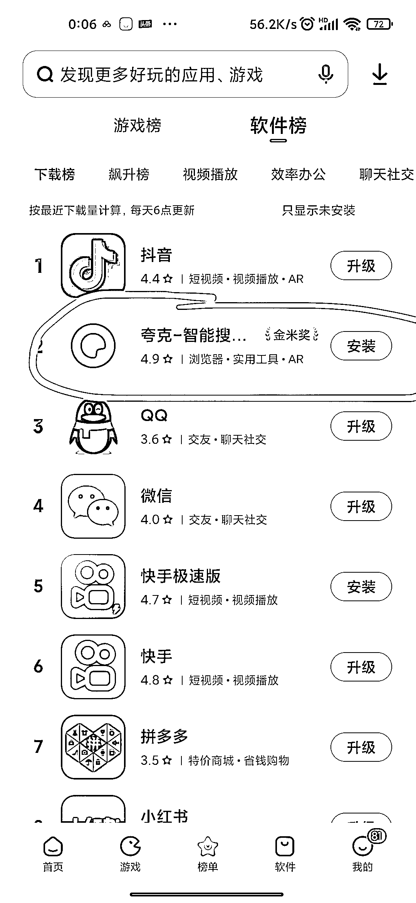

# 可根据软件下载榜或者最新的软件飙升榜，找到可以做的项目

> 原文：[`www.yuque.com/for_lazy/xkrm14/bh5zqo7i9rirwwgi`](https://www.yuque.com/for_lazy/xkrm14/bh5zqo7i9rirwwgi)

作者： 阿道无货源店群

日期：2023-03-23

点赞数：100

正文：

不知道做什么项目时，可以尝试一下软件下载榜或者最新的软件飙升榜，然后看选择一个软件，打开淘宝搜索这个软件的相关信息，会出来一堆衍生的小生意。 一定要有跨界思维，除了上面这样子，还可以尝试最近飙升的图书榜，搜索淘宝，最近飙升的热点，搜索公众号，淘宝，最近飙升的热度很高的电视剧电影+淘宝。

  

  

  

  

  

评论区：

橙丫 : 这个跨界思维很了不起

爱米粒 : 这个好厉害

张优强 : 这个思路[强][强][强]

阿道无货源店群 : 很多东西跨界一结合也会产生很多新产品，这个跨界是寻找思路

阿道无货源店群 : [偷笑]

阿道无货源店群 : [玫瑰]

猫小鱼🐱 : 这个思路太牛了

策马走天涯 : [强][强]

