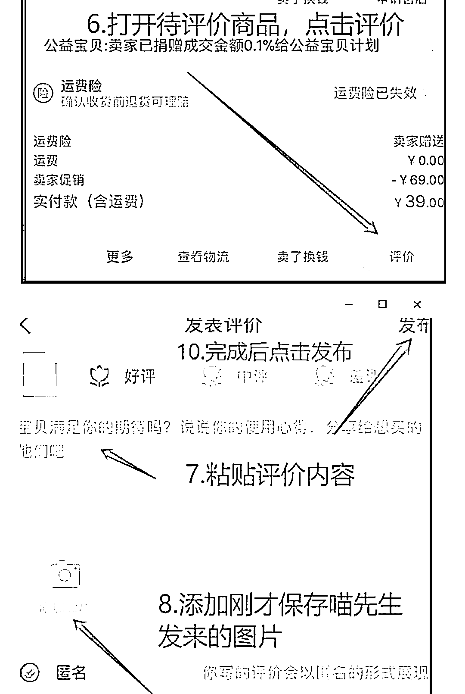

# 淘宝客，月入百万之收评引流玩法

> 原文：[`www.yuque.com/for_lazy/xkrm14/eaw1i432tfeedrxv`](https://www.yuque.com/for_lazy/xkrm14/eaw1i432tfeedrxv)

作者： 霸气哥

日期：2023-03-22

点赞数：28

正文：

月入百万之收评引 L 玩法 淘宝评价很多淘客朋友都知道，今天我们分享一个淘宝评价里面的一个分支玩法——收评价。在如今整体用户价值走高的情况下，有不少大佬选择自行引导用户，而收评价引导过来的用户，对淘客来说质量还是很不错的，许多大佬当年通过该玩法达到的月入百万的效果，时至今日，还是很多人在实操，有兴趣的朋友，可以查看这篇分享。 收评价大致流程为： 找到有进行网购操作的用户，每一个商品都可以进行两条评价，一条是初评，一条是追评。 大部分用户购物后并不会进行评价评星等操作，而这时，就可以将我们带有引流性质的内容，让用户上传至评论区。 此操作之后，其他未下单的用户浏览商品时，就可以查看到该条评价，就可以实现引流用户。 收评价优势： 1、与收评价用户而言，操作简单，并且可以马上结算，用户体验感强。增进信任之后，也方便日后进行其他操作。 2、购物用户能看到评论区所布置的图片，基本上都是属于未下单的用户，随之会马上被引导至目标账号，目标人群精准。 3、购物用户加进来后，大概率会进行下单操作，对我们而言，首单率高。 本期分享到此结束 想要此玩法更多细节，和行业优秀案例，可以找我免费领取。

评论区：

暂无评论

