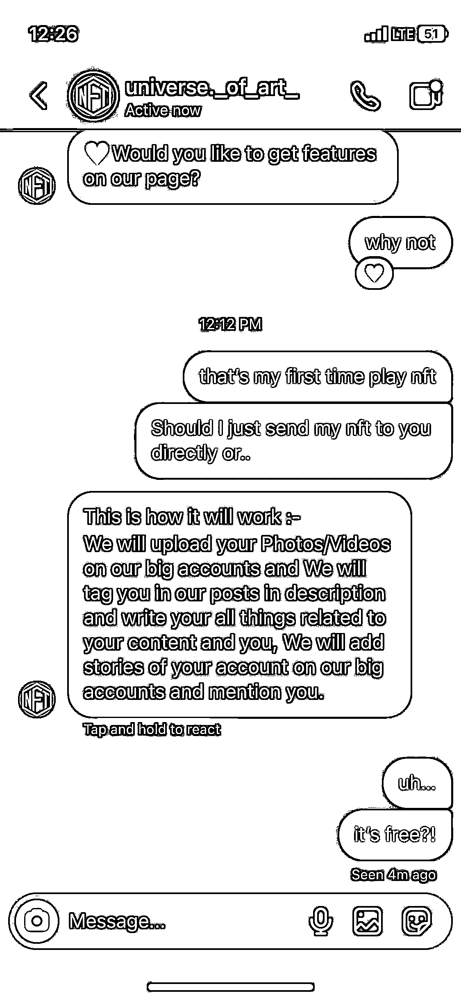
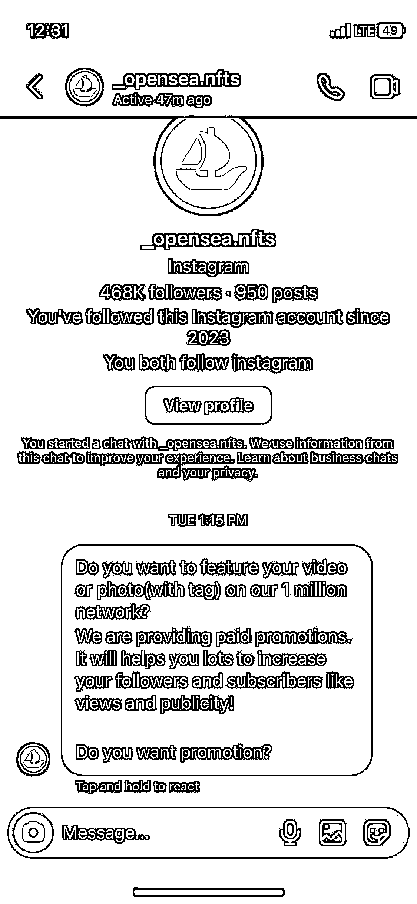
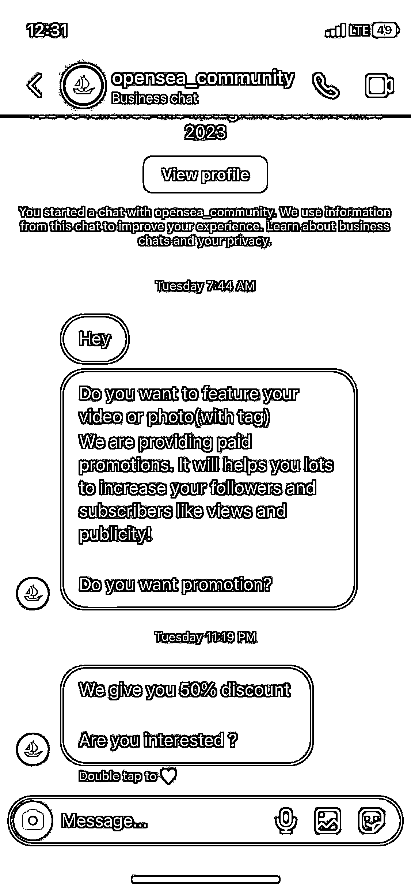
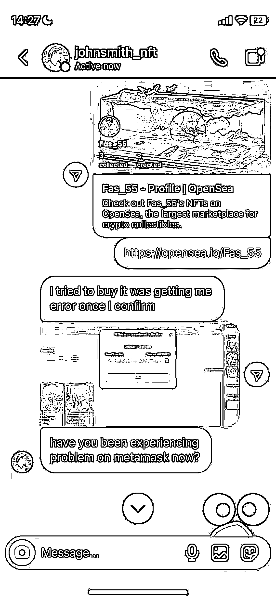

# 利用 AI 绘画制作出售 NFT 被骗经历

> 原文：[`www.yuque.com/for_lazy/xkrm14/vskw6qrnpg7qole7`](https://www.yuque.com/for_lazy/xkrm14/vskw6qrnpg7qole7)

作者： Jimmy Chen

日期：2023-03-21

点赞数：26

正文：

妄图耍小聪明利用 AI 绘画制作 nft 出售的人要注意了。很多时候，你以为自己拥有了强大的技术，可以为所欲为，以为别人都想不到的时候，往往很容易掉到坑里。 今天，我就有一个朋友被骗了，我从骗子的角度，理了一遍思路： 顺一遍思路： 1.推特找韭菜，高价求购 nft，降低心理界限，让人变得兴奋 2.事先通过让人点击自己的链接，或登陆自己的网站，获取对象的小狐狸钱包密码 3.说账号出现问题，并且提出是正常情况，并展示 opensea 与自己之前的沟通截图，要求往里面充值 0.2ETH 做一个保证，自己才能转账过去 4.受害者往里面充值了 0.2ETH，立马被转走（账号已被盗） 5.再次说明这是正常情况，打感情牌，并保证承诺，再给 0.2ETH 就可以成功解决问题了（实现二次变现） nft 的意义很大程度上并不取决于图像的样子而更多是背后的一些东西。比如项目方，模式，信任机制，热度…… 你本就毫无名气，别人为什么要来买你的画呢？ AI 绘画虽然说的很厉害，但说到底，他是一个门槛极低的事情，写点 prompt，大部分只要研究一下都能做。 所以在这件事情就不存在稀缺性了 那么又怎么能寄希望于通过单纯的 AI 绘画直接变现或者制作成 nft 轻松变现呢？ AI 绘画仅仅是因为现在新，存在一个信息门槛，而且大部分都是英文预料的训练模型，因此也存在一个地域门槛。 所以很多人都可以卖课程教别人怎么作画，可事实上，这些东西在信息差慢慢变少，基于中文语料的模型慢慢发展起来后，就并不需要人来教了，甚至是不需要怎么学习的东西，就像吃饭喝水一样 这次朋友虽然只是小小的损失了 2k，并没有酿成大祸。但这件事也提醒了我，人性的贪婪很容易被利用，每个人都要警惕。 不要觉得谁会那么傻。 有时候，不是你不傻。而是给你的刺激还不足以引起你犯傻而已 保持高度警惕和思考🤔

  

  

  

  

  

评论区：

暂无评论

