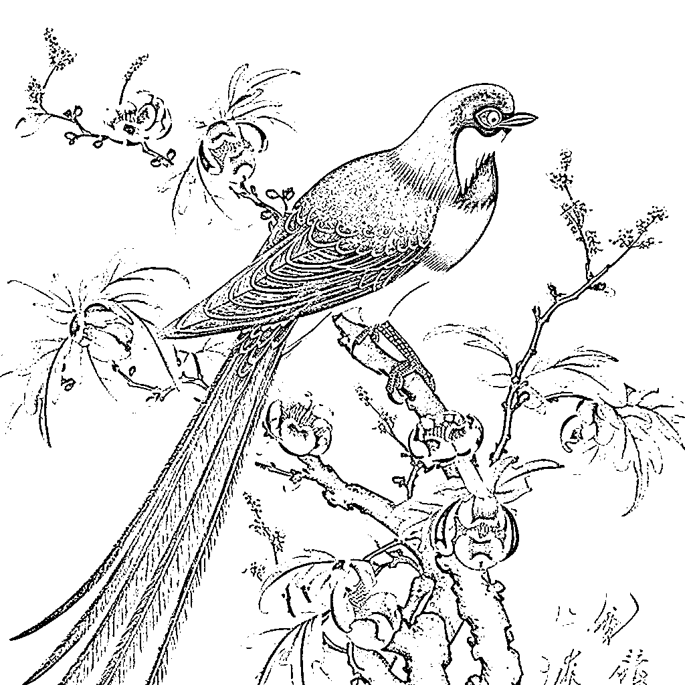

# Midjourney V5 体验分享

> 原文：[`www.yuque.com/for_lazy/xkrm14/zttgsvuyp2od9y75`](https://www.yuque.com/for_lazy/xkrm14/zttgsvuyp2od9y75)

作者： 行者

日期：2023-03-16

点赞数：38

正文：

Midjourney V5 体验 体验有感： 1.Ai 不会画手的问题得到了很大程度的解决了 2.V5 输出的图片更细腻 效果更好了 Midjourney V5 可以正式使用啦 💡两种开启方式 ①【默认开启】输入/setting，开启默认 V5（每次使用会有自动后缀--v 5） ②【手动开启】直接在描述词尾加上 --v 5 V5 新特性 1\. 风格范围更广，对提示的反应更灵敏 2\. 图像质量高得多（分辨率提高 2 倍），动态范围得到了改善 3. 图像更细致，细节更有可能是正确的；输入更少的不想出现的文本 4\. 改进了图像提示的性能 5\. 支持--tile 参数，用于无缝拼接（处于实验中） 6. 支持--ar 长宽比大于 2:1（处于实验中） 7\. 支持--iw，以权衡图像提示与文本提示的关系

  

  

  

评论区：

感恩学习相信-小陶 : 谢谢分享

Luke 王子 : 感谢分享！

