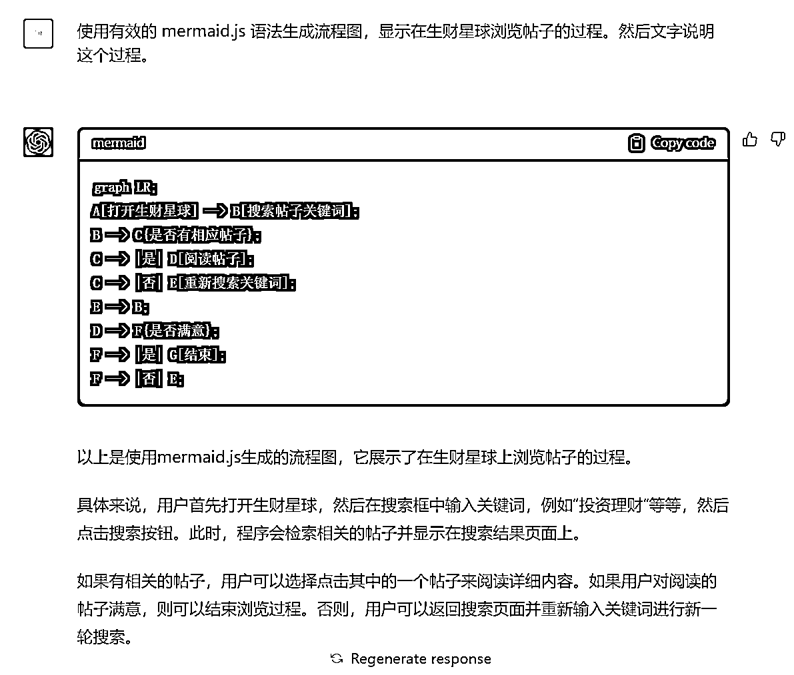

# ChatGPT + mermaid.js =流程图生成器

> 原文：[`www.yuque.com/for_lazy/xkrm14/up8zv8q9wknq5pdt`](https://www.yuque.com/for_lazy/xkrm14/up8zv8q9wknq5pdt)

作者： 麻木尔杜斯戈里亚

日期：2023-03-13

点赞数：30

正文：

ChatGPT + mermaid.js = 由自然语言驱动、可修改的流程图/用户旅程图/甘特图......生成器 有很多流程，用自然语言说起来挺简单，但画成标准的流程图还挺麻烦的，现在通过 ChatGPT + mermaid.js，使用自然语言描述，即可生成这些麻烦的图表，而且支持修改。 下面是一些例子 【图 1】&【图 2】：生成“用户搜索并浏览生财星球帖子”的流程图 【图 3】&【图 4】：觉得不太满意，加了一个“判断帖子信息是否过时”的策略，并更新了原流程图 【图 5】&【图 6】：生成甘特图，用来管理“今年出版两本书”的计划和时间节点 项目（产品）经理职场效率+1

  

  

  

  

  

  

评论区：

波叔 : 太牛啦

麻木尔杜斯戈里亚 : (｡ì _ í｡)

赈早见海 : 可以打包成一个工具了，类似上条风向标 [https://www](https://www).

