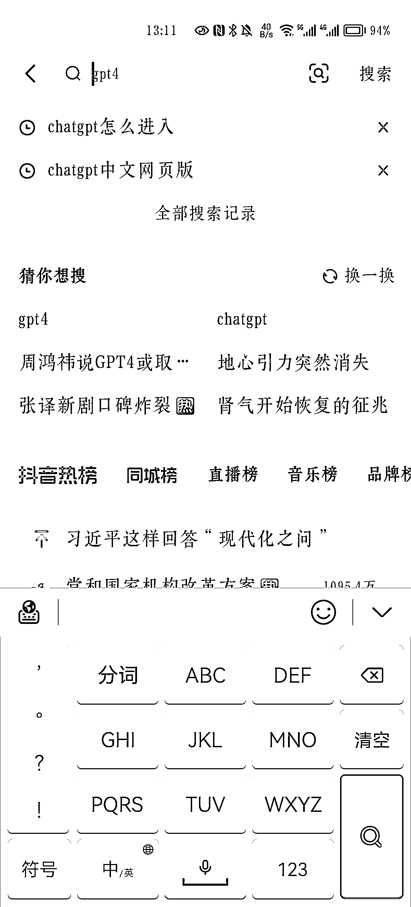
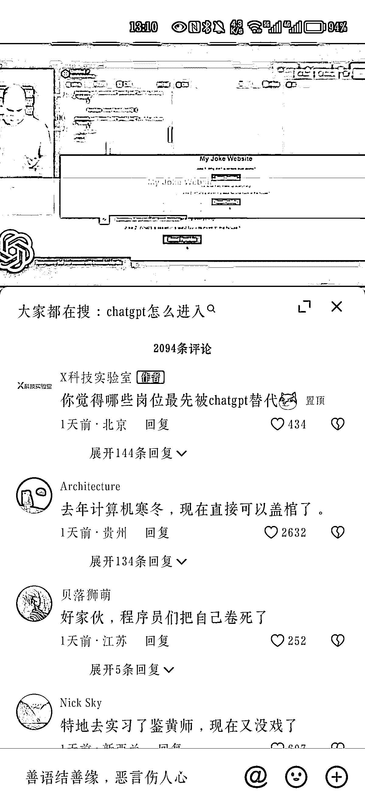
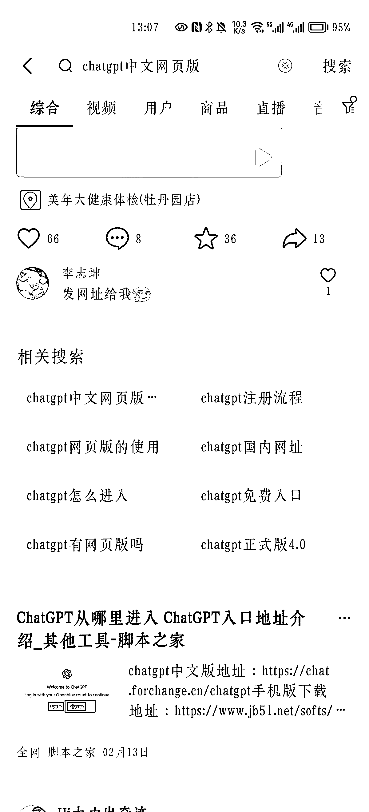

# 抖音 SEO 词汇来源

> 原文：[`www.yuque.com/for_lazy/xkrm14/mgbc9w5w18c33bxm`](https://www.yuque.com/for_lazy/xkrm14/mgbc9w5w18c33bxm)

作者： AUDI

日期：2023-03-17

点赞数：26

正文：

使用过抖音的应该能知道，从技术 SEO 引流场景，可以借鉴的词有 【输入框框词】 【评论处漂蓝】 【猜你想搜】 【结果页面推荐词】 这些都可以做 SEO 去扑词，铺流量

  

  

  

  

评论区：

暂无评论

