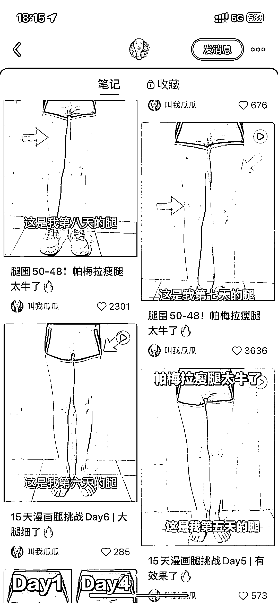
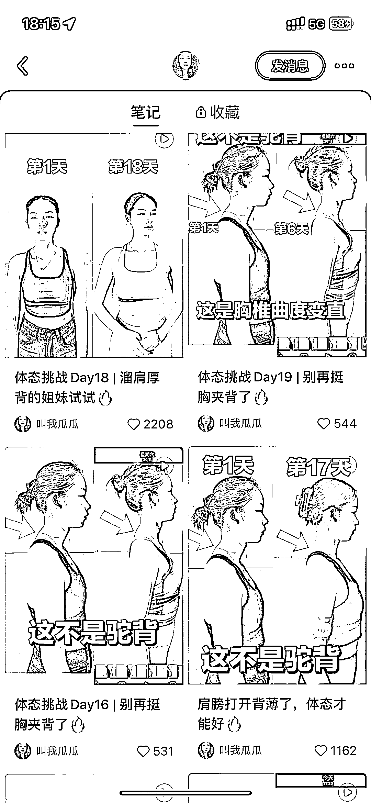

# 小红书体态纠正视频打卡，私域引流变现

> 原文：[`www.yuque.com/for_lazy/xkrm14/wy3wrv0za7bks7ag`](https://www.yuque.com/for_lazy/xkrm14/wy3wrv0za7bks7ag)

作者： 英麒 Ryan

日期：2023-03-16

点赞数：59

正文：

从去年开始，几乎每天打卡发自己的体态纠正视频，发着发着，观众也跟打卡，开始接商单了

  

评论区：

💪🏻吉吉积极向上 : 记录自己做事，成长，变美的过程

英麒 Ryan : 而且很垂直，任何一个想变好的小领域，都可以像这样公开打卡

💪🏻吉吉积极向上 : 是的呢

封伟-自动化变现 : 体态纠正受众较广，不仅影响形象而且会影响身体健康，儿童上班族青年成人都有相关需求。 一般有功能型和纯体态性改善服务，如形体训练，矫正辅具订制，疼痛康复，改善私教，运动表现提分（运动爱好者） 一般线下服务 250-300/次，训练营或按方案购买可达上千上万 辅具订制如鞋垫单价，一次性可达上千 运块康复行业这块的融资有过 c 轮的 只要找准好发力点，结合自己的优势，变现机会很大 小程序及 seo 技能，做平台收商家的钱，小程序提交照片自动识别期待评估结果，结合百度支付宝抖音微信的搜一搜优化，为健身房，瑜伽馆，运动康复中心商家导流，广告提成变现 自媒体 IP 技能，做 IP 赚用户的钱，体态矫正 ip，keep 每日瑜伽等运动平台，小红书抖音视频输出，付费咨询训练营，知识付费变现 综合运营技能，做顾问收商家的钱，线上自媒体代运营，seo 优化，美团代运营等，线下针对青少年培训机构异业合作矫正体态步态，帮助品牌扩张。

