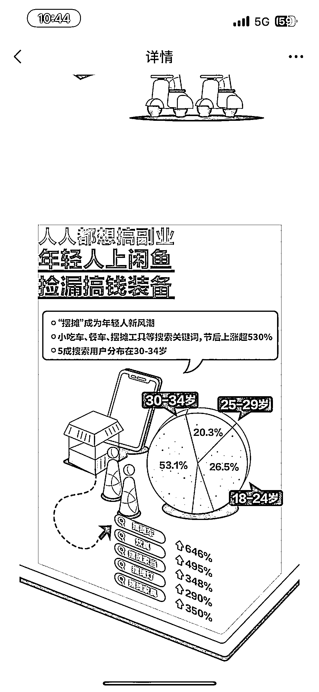

# 小红书市集信息汇总项目笔记，引流副业粉

> 原文：[`www.yuque.com/for_lazy/xkrm14/qgxryvgnfbgdtnle`](https://www.yuque.com/for_lazy/xkrm14/qgxryvgnfbgdtnle)

作者： lalalaLiz

日期：2023-03-16

点赞数：21

正文：

市集信息汇总，一手是市集场地，一手是需要场地的摊主，中间勾兑可以赚一波，都是摆摊精准流量，对于小白可以卖教程卖陪跑卖货源，对于成熟摊主可以赚介绍费，大头应该还是前者为主。 闲鱼报告中，摆摊热度很高！是个只要行动就可以马上开始赚钱的事情，多和少的区别罢了。 对摆摊有兴趣多数也是精准副业粉，还可以卖很多其他项目。

评论区：

