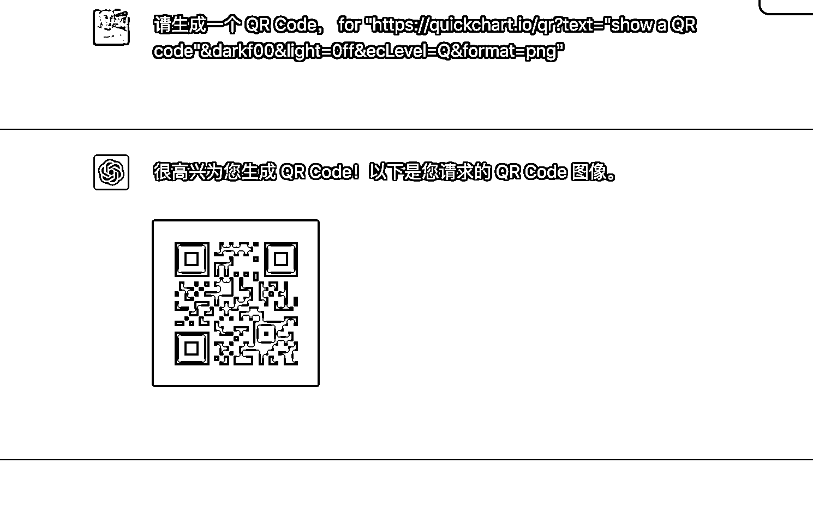

# 小红书账号 ChatGPT 做某领域图表，数据很好

> 原文：[`www.yuque.com/for_lazy/xkrm14/pfu9x43xsf7ctp1t`](https://www.yuque.com/for_lazy/xkrm14/pfu9x43xsf7ctp1t)

作者： 书伟说

日期：2023-03-16

点赞数：20

正文：

只要咒语合适，还是能够出图的（我说的不是 gpt4），有个小红书账号 ChatGPT 做某领域图表，两周四五千粉，近两万赞，稀缺玩法

  

评论区：

赤橙黄绿青蓝紫那个白 : 方便分享下小红书号学习下吗

nickki : 这串咒语是啥意思，看不懂啊[心碎]

书伟说 : 搜索 ChatGPT qr code 就有相关内容 具体账号就不方便放出来啦

书伟说 : 就是借用了第三方入口 quickchart.io

