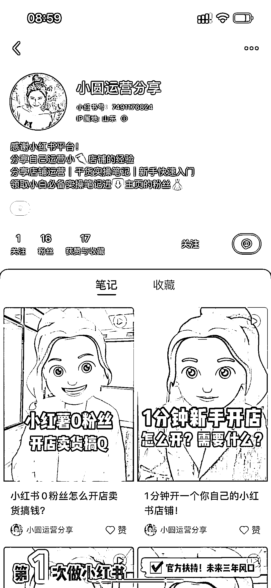
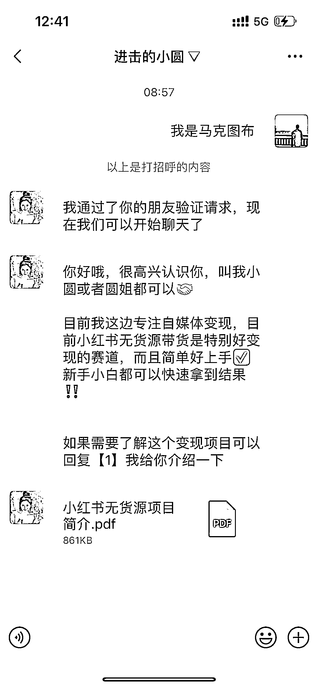
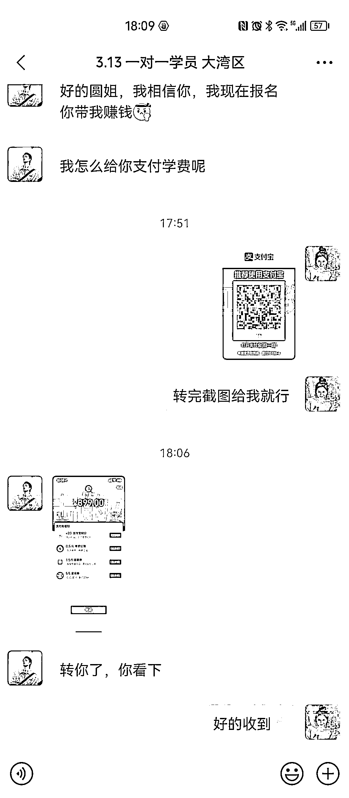

# 小红书虚拟电商带货一对一付费玩法，图文直接带客变现

> 原文：[`www.yuque.com/for_lazy/xkrm14/yk9erw1tpqmt8kfp`](https://www.yuque.com/for_lazy/xkrm14/yk9erw1tpqmt8kfp)

作者： 马克图布

日期：2023-03-15

点赞数：43

正文：

小红书虚拟电商带货一对一付费玩法，图文直接带客变现。特别有意思。 以这个博主举例子，他自己本身的大号，介绍虚拟开店，其实视频一点效果都没有。 然后他就另辟蹊径了，他直接做另一个图文号，把店铺的后台的销售额截图啊，做成一篇篇笔记，加一些标题党内容，笔记爆款了，然后来吸引小白进群，像他的群已经加到了 300 多人，然后在群里直接引流到微信。 微信里面在一个自动回复的自我介绍，就是教别人带货啊。 后端表现一个名额是 399。变现很强。 她主要是把流量玩明白了。小号图文引流，然后朋友圈卖一对一服务，做的很顺。 其实大家可以参考她的图文形态，快速变现。

  

  

  

  

  

  

评论区：

