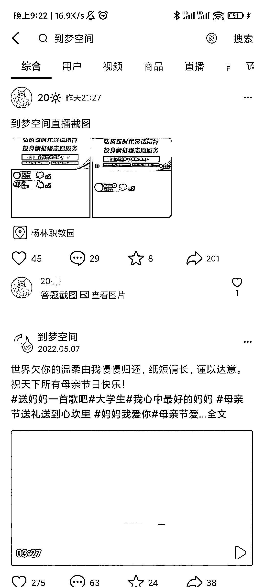

# 到梦空间，大学生管理系统，可引流大学生粉

> 原文：[`www.yuque.com/for_lazy/xkrm14/luhxzdnvbnvlzzrf`](https://www.yuque.com/for_lazy/xkrm14/luhxzdnvbnvlzzrf)

作者： 七小

日期：2023-03-13

点赞数：50

正文：

1.发现了一个奇怪的词【到梦空间】，搜索指数还挺高。月搜索人次 60w+，近期暴涨。 2.去搜了一下，发现它是大学校园学生管理系统的 app 3.在抖音上搜这个词，发现一条内容，放的是【直播截图】，评论转发挺高，是异常值 4.打开评论区，很多人都在求图，说保存不了。 梳理之后发现逻辑是这样： 1.这是个大学生管理系统，估计是学校要求学生去参加直播，还要截图证明，以此考核学分？ 很多学生没到场参加，为了给学校交差，事后来求图。 2.从中发现的机会是：引流大学生粉，除了学习资料引流，还可以用这类【考核/给学校交差需要的证明】，来引流。 再搭配一些大学生公共课的资料，可以来做网盘拉新项目了。

  

  

  

  

评论区：

潮州痞子蔡 : 划重点：这个词怎么发现的？

七小 : 小程序 极客增长 暴涨词

潮州痞子蔡 : 这个我刚才查了一下，实际这个校园的项目是共青团主导的，类似成人版的“学习强国”，至于引流方面慎重，毕竟涉及 ZZ

七小 : 有道理，谢谢提醒

一尘学长 : 这个属于大学生二课 基本上都是学生课余活动，会给学时，但是报名名额有限，或者报名了不去，就需要这种图去打卡，但是这种打卡一般会设置范围，如果能引流，可以引流精准的某个大学的学生流量。 目前本科 4 年要修够 128 个学时，专科 64 个学时。

薇姐买房 : 赞发现过程 探索过程

