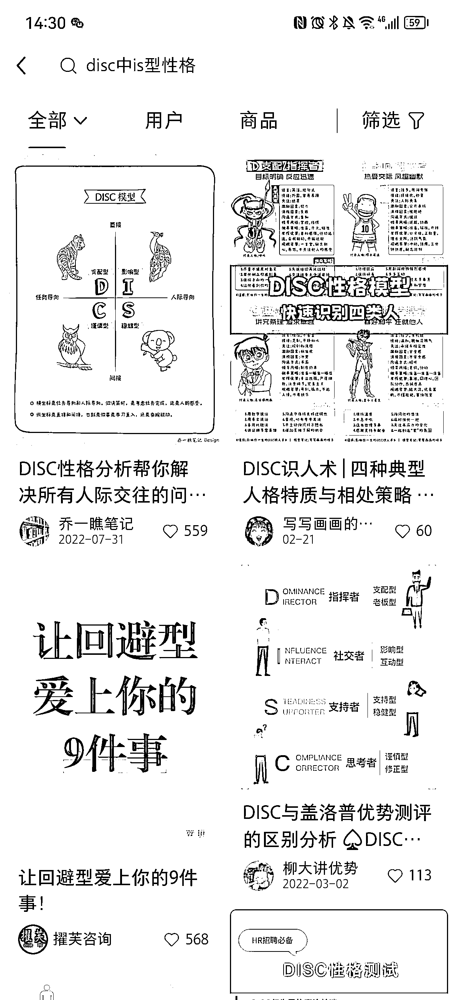

# 小红书做性格测试笔记，引流私域

> 原文：[`www.yuque.com/for_lazy/xkrm14/kr7a0ws1u31w4xnk`](https://www.yuque.com/for_lazy/xkrm14/kr7a0ws1u31w4xnk)

作者： 蓝子鱼

日期：2023-03-13

点赞数：23

正文：

最近小红书上有一类测试性格模型的内容很火，做性格测试，优势测试的可以试着引流。 目前我朋友的玩法是发下面的链接给其他人测，然后测出来有报告就可以发小红书，然后再加上一些聊天记录，很多人想测，一个月都加了上千个微信了。 [免费的人格测试 ++++++++ ++++++++|+16Personalities](https://www.16personalities.com/ch/%E4%BA%BA%E6%A0%BC%E6%B5%8B%E8%AF%95)

评论区：

抖 sir : 这个不是免费测试吗，加了微信付费测试吗

蓝子鱼 : 你不要把链接发出来，他们要测就要加你微信

抖 sir : 喔喔，这样啊

潮州痞子蔡 : 这个可以做付费，同时也可以延申，除了性格测试外，还可以有其他

