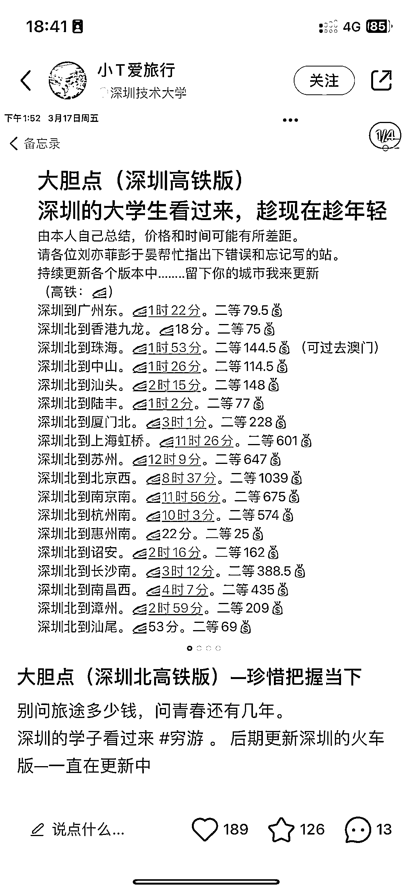
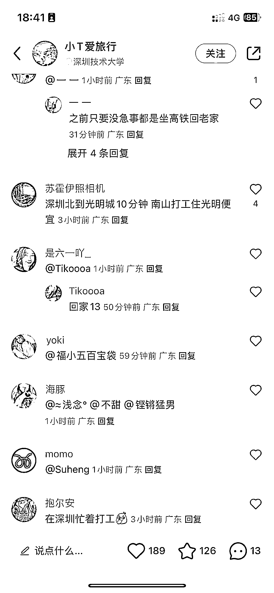
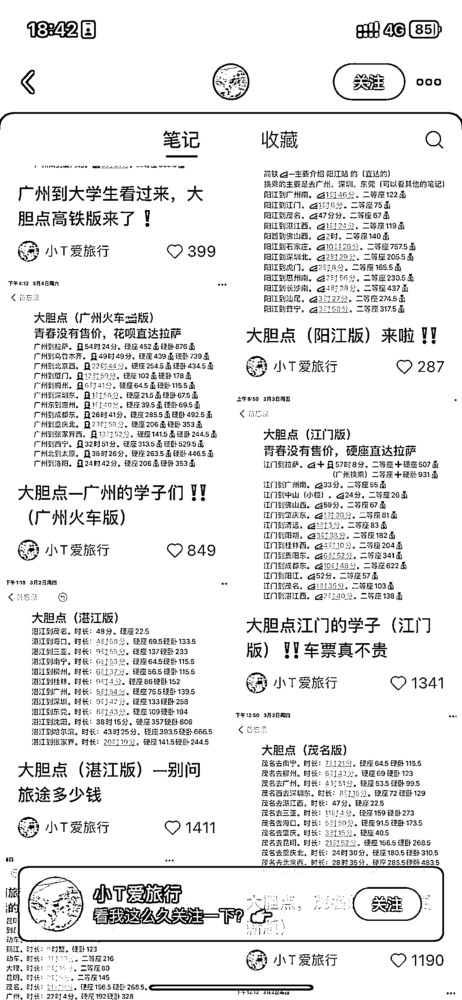
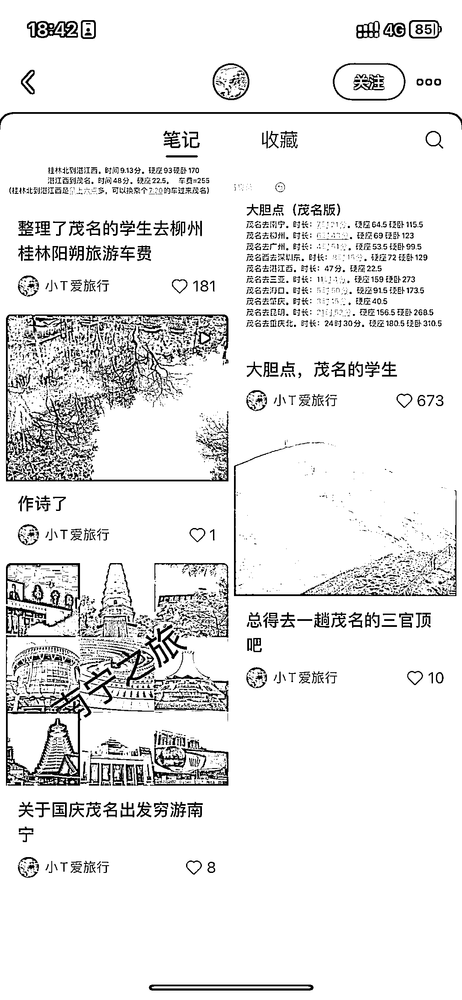

# 小红书定位大学生发从城市出发旅游高铁时间合集，互动数据好

> 原文：[`www.yuque.com/for_lazy/xkrm14/ad5e0ysd54s5dqlq`](https://www.yuque.com/for_lazy/xkrm14/ad5e0ysd54s5dqlq)

作者： 曾丽@丽丽曾

日期：2023-03-17

点赞数：99

正文：

以某个城市为出发点，在 发旅游高铁时间合集，容易爆。 小细节：定位选 xx 大学或 xxxx 学院。

  

  

  

评论区：

苏苏李 : 如何变现呢

花满楼 : 怎么变现

土豆君 : 变现有方法，吸引的都是旅游人群，可以通过资料引流比如各地高铁时间最全合集资料引流到微信，再通过旅游产品变现，比如提供比携程等 app 更便宜的酒店、景点门票订购等。

高建中-扬州-婚礼庆* : 想不通，为啥爆，这些网上一搜不就出来了吗？

高建中-扬州-婚礼庆* : 变现估计就是旅游景点酒店等分销，还有纪念品等周边吧

芳小姐 : 懒人经济，有些人连搜索都懒得搜。有人整理出来，一目了然，省去自己搜索整理总结的时间。

爱吃鱼的猫 : 但却愿意在小红书上搜，也是让人想笑

高建中-扬州-婚礼庆* : 好吧

