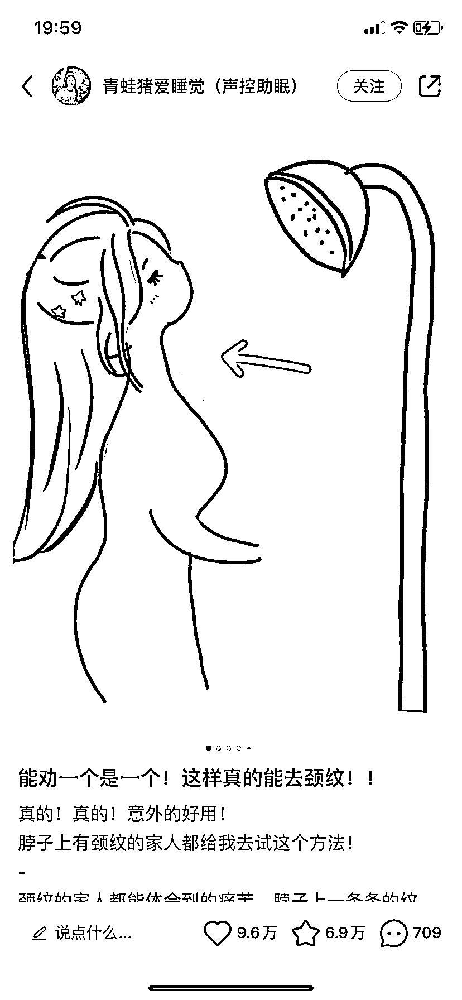

# 小红书笔记封面，可以采用针对用户痛点的漫画形式

> 原文：[`www.yuque.com/for_lazy/xkrm14/zku4mh4g306lx9bc`](https://www.yuque.com/for_lazy/xkrm14/zku4mh4g306lx9bc)

作者： 胡先森

日期：2023-03-17

点赞数：71

正文：

小红书笔记可以参考下面这种封面针对用户痛点的漫画形式（画面吸引+好奇的感的标题）。

  

评论区：

陈田 : 这种封面怎么制作

HRJ : 同问

胡先森 : 手绘的吧？

