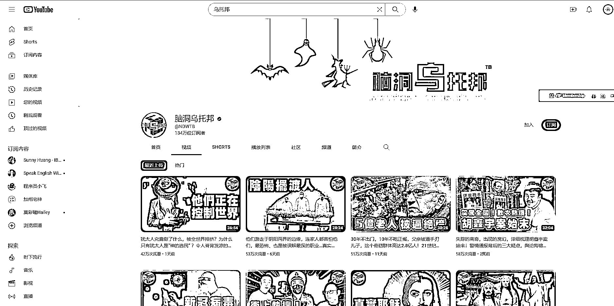

# 海外中文自媒体之会员盈利

> 原文：[`www.yuque.com/for_lazy/xkrm14/ulr1oo1ak4l1wixo`](https://www.yuque.com/for_lazy/xkrm14/ulr1oo1ak4l1wixo)

作者： 米笠

日期：2023-03-14

点赞数：16

正文：

海外中文自媒体之会员盈利 很多悬疑，历史类自媒体，不仅在国内平台受欢迎 在 youtube 上汉语悬疑、历史类内容浏览量也非常高 很多自媒体博主，都是多平台分发 例如西瓜、B 站、youtube 等 除了赚流量分成 在 youtube 做这类内容，还有一个盈利方式就是会员订阅 订阅价格一般都是几美元每个月 国外用户的付费意识要比国内用户强的多。 在媒体博主可以推出会员专享内容，赚取额外的会员订阅费。

  

  

  

评论区：

