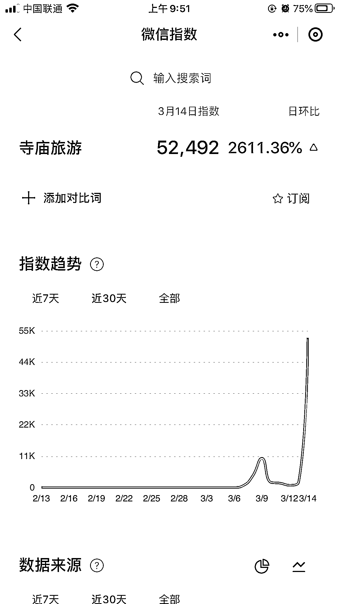
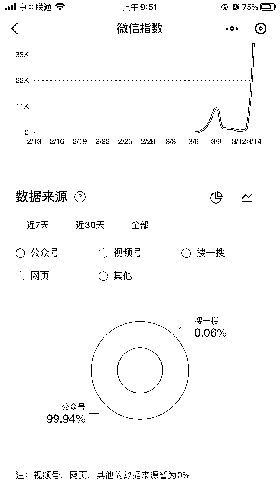
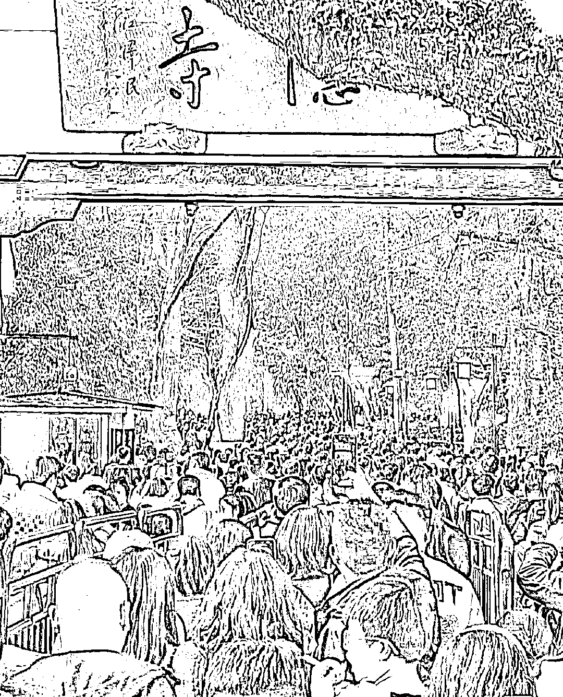

# 分享一个异常值的词，寺庙旅游

> 原文：[`www.yuque.com/for_lazy/xkrm14/watia2brryiwmugy`](https://www.yuque.com/for_lazy/xkrm14/watia2brryiwmugy)

作者： 雨辰

日期：2023-03-15

点赞数：31

正文：

分享一个异常值的词，寺庙旅游 这个词之前在抖音和小红书也有不少的流量和相关视频、笔记，然后刚才搜了一下微信指数，日环比 2611%，突然增加了搜索量。 做旅游、佛学等方面的圈友可以布局一下，线下可以考虑定制寺庙旅游专线，寺庙周边文创商品。 线上可以做直播间代上香服务、云祈福服务。 还可以引流到私域，基本上都是年轻的大学生粉，后续变现空间也不错。 [杭州灵隐寺疯了吗？早上 7 点被年轻人挤爆！排队烧香，狂买周边设计，试问：年轻人为何疯狂迷上寺庙旅游？](https://mp.weixin.qq.com/s/jknj1lU5iHG7NsyLUD5B_Q)

  

  

  

  

  

评论区：

