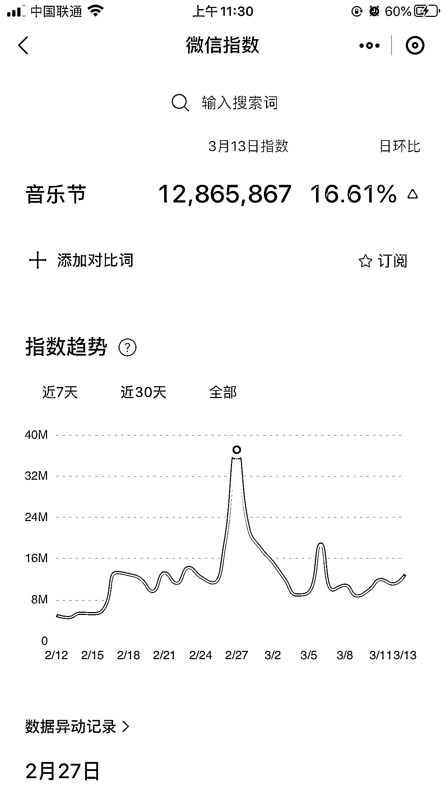
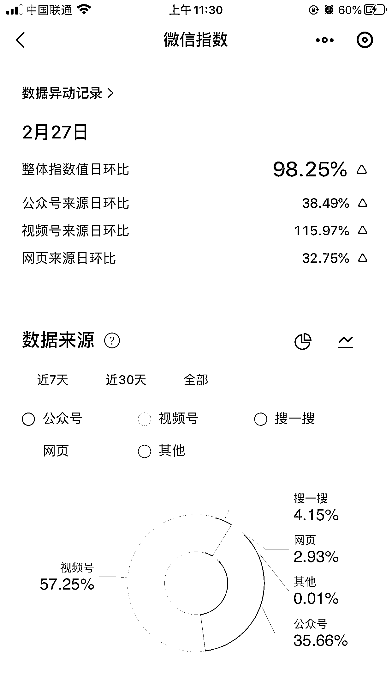
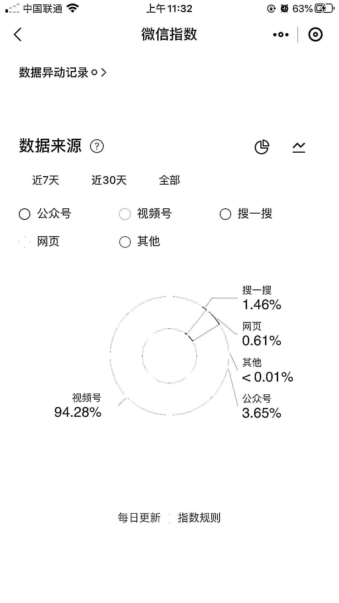
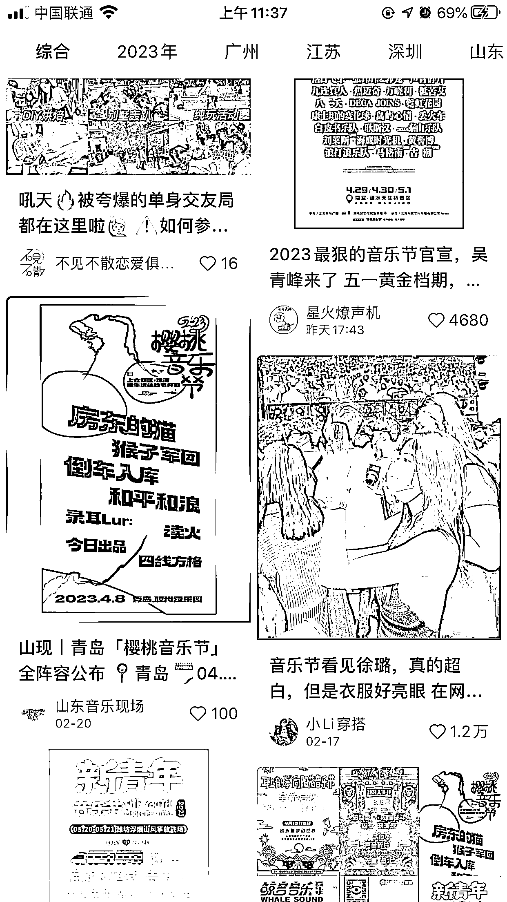

# 异常值：今年的音乐节特别多，相关周边存在机会

> 原文：[`www.yuque.com/for_lazy/xkrm14/sctutp6c2ws1ss6g`](https://www.yuque.com/for_lazy/xkrm14/sctutp6c2ws1ss6g)

作者： 雨辰

日期：2023-03-14

点赞数：18

正文：

分享一个异常值 和女朋友聊天的时候发现今年的音乐节特别多，去微信指数搜索了一下，千万级的搜索量，而且大部分还是来源于视频号。小红书上关于音乐节的数据也不错。 大家可以用音乐节噱头进行引流，基本都是有消费能力的大学生。 也可以线下变现，去音乐节现场卖黄牛票，订制音乐节包车服务，音乐节现场摆摊售卖等

  

评论区：

