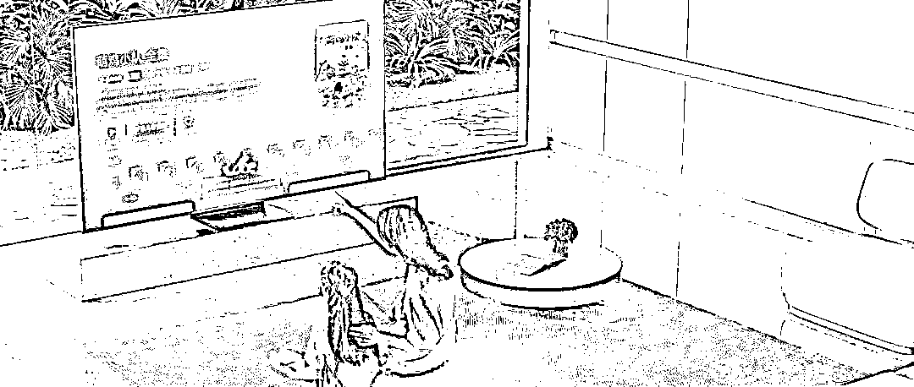

# 大屏营销正“狂飙”，激活万亿婴童市场新增量

> 原文：[`www.yuque.com/for_lazy/xkrm14/fiswfcm4ot4y1h37`](https://www.yuque.com/for_lazy/xkrm14/fiswfcm4ot4y1h37)

作者： 少儿探索科学实验室

日期：2023-03-13

点赞数：6

正文：

大屏营销正“狂飙”，激活万亿婴童市场新增量 数据显示，从 2020 年到 2022 年，相比移动端网络视频平台，消费者使用 OTT 观看内容的倾向度中，少儿节目增长 54%，增速远超电视剧、综艺、电影等热门内容。

评论区：

