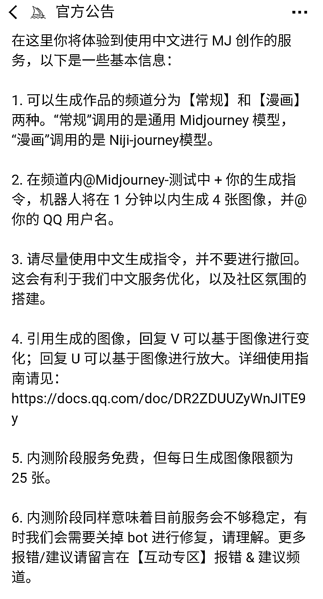

# Midjourney 国内版内测，加 qq 频道@机器人 进行绘画

> 原文：[`www.yuque.com/for_lazy/xkrm14/ec7g8y1i2kbbhe5s`](https://www.yuque.com/for_lazy/xkrm14/ec7g8y1i2kbbhe5s)

作者： 许山山

日期：2023-03-23

点赞数：42

<ne-card data-card-name="hr" data-card-type="block" id="qjZuV" data-event-boundary="card">

正文：

midjourney 国内版内测，加 qq 频道 at 机器人画画，引用机器人的回复 u 放大，v 变换，每天可以画 25 张图。看反馈中目前对中文的支持和百度有类似的问题。 以下来自官方公告: 尚未加入频道的用户，欢迎填写《Midjourney QQ 频道 · 内测邀请表》加入 Wait List，当我们准备好容纳更多用户后，会通知您，感谢您的耐心等待：[Midjourney+QQ+频道+·+内测邀请表](https://docs.qq.com/form/page/DR2hWQUVlbXNxVEF5)

<ne-card data-card-name="image" data-card-type="inline" id="naPq1" data-event-boundary="card"></ne-card>

<ne-card data-card-name="image" data-card-type="inline" id="PVahg" data-event-boundary="card"></ne-card>

<ne-card data-card-name="image" data-card-type="inline" id="V4LJl" data-event-boundary="card"></ne-card>

<ne-card data-card-name="image" data-card-type="inline" id="EiTxk" data-event-boundary="card"></ne-card>

<ne-card data-card-name="hr" data-card-type="block" id="U64CS" data-event-boundary="card">

评论区：

暂无评论

<ne-card data-card-name="hr" data-card-type="block" id="YmYGF" data-event-boundary="card">

公众号懒人找资源，懒人专属群分享

</ne-card></ne-card></ne-card>