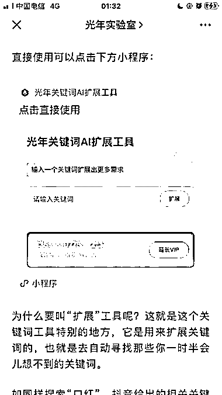
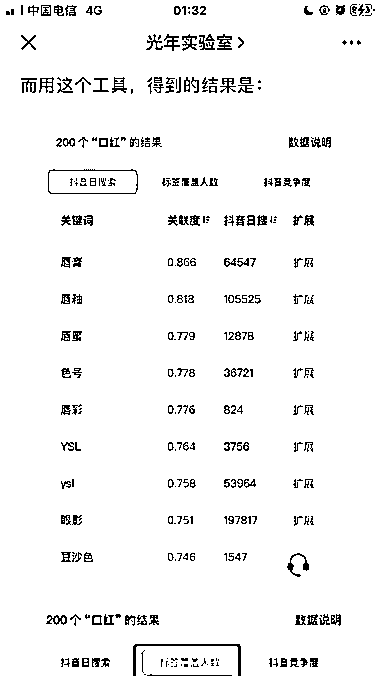

# 光年关键词 AI 扩展工具： 根据关键词去拓展相关的关联词

> 原文：[`www.yuque.com/for_lazy/xkrm14/fo4ov250rdlvw0v8`](https://www.yuque.com/for_lazy/xkrm14/fo4ov250rdlvw0v8)

作者： 怡成

日期：2023-03-23

点赞数：59

<ne-hole id="u5e13aa7e" data-lake-id="u5e13aa7e"><ne-card data-card-name="hr" data-card-type="block" id="R7ukH" data-event-boundary="card">

正文：

光年实验室出了一个新品： •根据关键词去拓展相关的关联词 这可以解决很多人不知道搜索什么关键词的问题 [一个能让收入增加好几倍的关键词工具](https://mp.weixin.qq.com/s/ZNCbkwvaJOJ_J1mmB8VoZg)

<ne-card data-card-name="image" data-card-type="inline" id="gU5QA" data-event-boundary="card">  <ne-p id="ub5fc88d7" data-lake-id="ub5fc88d7"><ne-card data-card-name="image" data-card-type="inline" id="CT6xW" data-event-boundary="card">  <ne-p id="uef571443" data-lake-id="uef571443"><ne-card data-card-name="image" data-card-type="inline" id="YLdll" data-event-boundary="card">  <ne-hole id="u8b884ecc" data-lake-id="u8b884ecc"><ne-card data-card-name="hr" data-card-type="block" id="PyKbr" data-event-boundary="card"><ne-p id="u73e9e373" data-lake-id="u73e9e373">评论区：

野鸭冲锋队 : 额这也能中标吗

怡成 : 中标不是目的，信息分享是重点哦

野鸭冲锋队 : [强]棒，我一直关注光年实验室在，没有这个分享的意识，向你学习

<ne-hole id="u8f066c4b" data-lake-id="u8f066c4b"><ne-card data-card-name="hr" data-card-type="block" id="F1Iak" data-event-boundary="card">

公众号懒人找资源，懒人专属群分享

</ne-card></ne-hole></ne-card></ne-hole></ne-card></ne-p></ne-card></ne-p></ne-card></ne-p></ne-card></ne-hole>