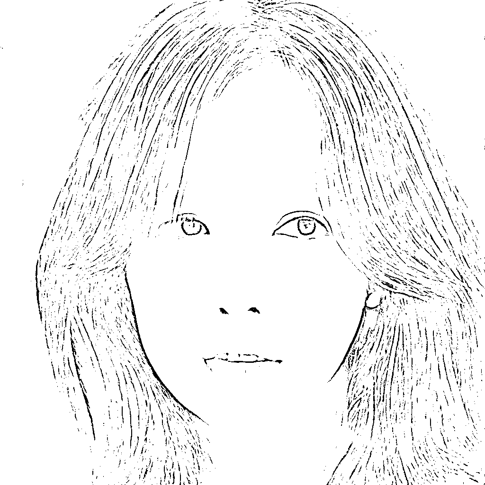
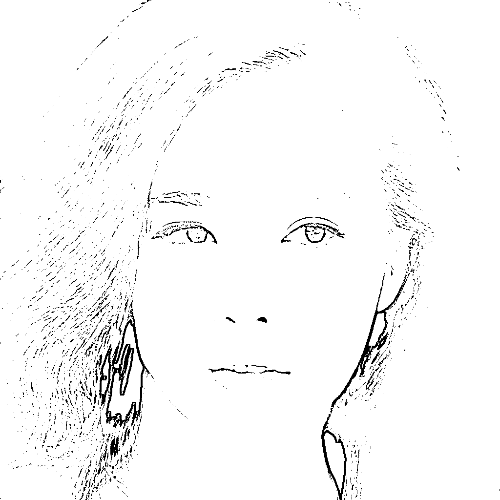

# AI 应用，试发型，换发型，底层用的生成对抗网络

> 原文：[`www.yuque.com/for_lazy/xkrm14/zkyh081wgeib9wu6`](https://www.yuque.com/for_lazy/xkrm14/zkyh081wgeib9wu6)

作者： Jacky

日期：2023-03-22

点赞数：12

<ne-hole id="ud6e7b4f3" data-lake-id="ud6e7b4f3"><ne-card data-card-name="hr" data-card-type="block" id="kZPYq" data-event-boundary="card">

正文：

试发型，换发型，底层用的生成对抗网络。我自己部署测试：图 1 分别换上图 2 和图 3 的发型，得到图 4 图 5 效果。 整体效果还不错，不过这个项目也有些问题，比如生成时间久，我用的 t4 显卡，换一次发型大概要 5-8 分钟 另外个问题是需要人脸对齐，就是需要头部的图片，脸放到正中间 这样有的用上半身图片的话会截成了头部，看不到整体效果，这个问题应该可以自己修改结构进行训练解决 另外也可以用扩散模型来做换发型，效果应该会更好，但是目前没有找到专门针对发型测试的项目，有兴趣的研究研究 [GitHub+-+Taeu/Style- Your-Hair:+Official+Pytorch+im...](https://github.com/Taeu/Style-Your-Hair)

<ne-card data-card-name="image" data-card-type="inline" id="rIcws" data-event-boundary="card"></ne-card>

<ne-card data-card-name="image" data-card-type="inline" id="VluSZ" data-event-boundary="card"></ne-card>

<ne-card data-card-name="image" data-card-type="inline" id="klEre" data-event-boundary="card"></ne-card>

<ne-card data-card-name="image" data-card-type="inline" id="omE8f" data-event-boundary="card"></ne-card>

<ne-card data-card-name="image" data-card-type="inline" id="kwIkq" data-event-boundary="card"></ne-card>

<ne-hole id="u596bc913" data-lake-id="u596bc913"><ne-card data-card-name="hr" data-card-type="block" id="QFlrJ" data-event-boundary="card">

评论区：

暂无评论

<ne-hole id="u90f5ce8e" data-lake-id="u90f5ce8e"><ne-card data-card-name="hr" data-card-type="block" id="zrLrR" data-event-boundary="card">

公众号懒人找资源，懒人专属群分享

</ne-card></ne-hole></ne-card></ne-hole></ne-card></ne-hole>