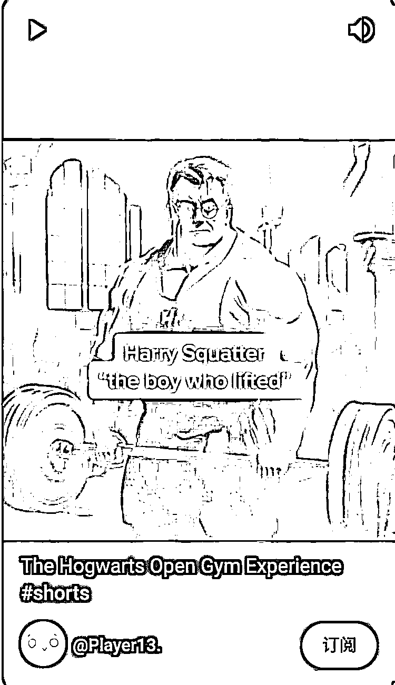

# 通过 AI 生成图片制作视频，可以批量操作

> 原文：[`www.yuque.com/for_lazy/xkrm14/virgbd5eps8ucrgp`](https://www.yuque.com/for_lazy/xkrm14/virgbd5eps8ucrgp)

作者： 雪风

日期：2023-03-22

点赞数：29

<ne-hole id="u453b35bd" data-lake-id="u453b35bd"><ne-card data-card-name="hr" data-card-type="block" id="fS77W" data-event-boundary="card">

正文：

通过 AI 生成图片制作视频，应该可以批量操作，这个视频在 YouTube 上有 400w 的播放量 [https://youtube.com/shorts/z_jQSgFyZqc?feature=sha...](https://youtube.com/shorts/z_jQSgFyZqc?feature=share)

<ne-card data-card-name="image" data-card-type="inline" id="K37pG" data-event-boundary="card"></ne-card>

<ne-hole id="ucaea35ec" data-lake-id="ucaea35ec"><ne-card data-card-name="hr" data-card-type="block" id="SXs4v" data-event-boundary="card">

评论区：

短视频 I 直播 I : 怎么生产的呀

淇淇子 : 按图片上面的关键词生成的吗？

肉の嘟 : 求生成图片的路子

<ne-hole id="u6a7e923f" data-lake-id="u6a7e923f"><ne-card data-card-name="hr" data-card-type="block" id="dy3xb" data-event-boundary="card">

公众号懒人找资源，懒人专属群分享

</ne-card></ne-hole></ne-card></ne-hole></ne-card></ne-hole>