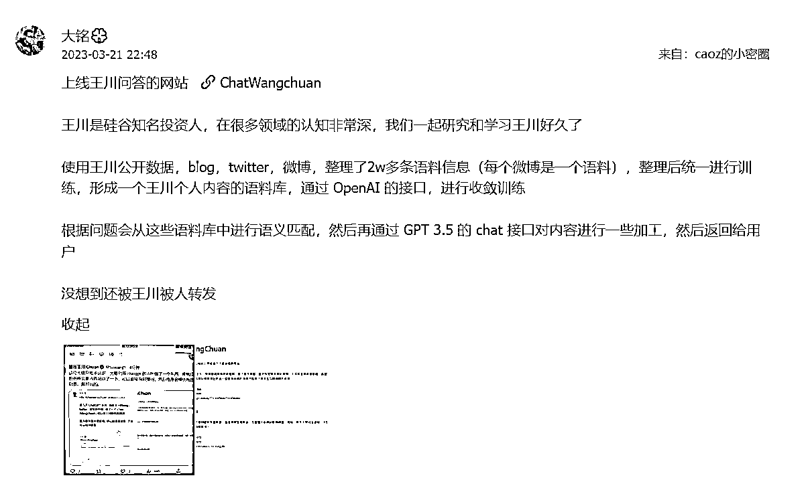

# 硅谷王川老师，现在有 AI 版本「Chat WangChuan」

> 原文：[`www.yuque.com/for_lazy/xkrm14/zmdkg7pqu8mts1hg`](https://www.yuque.com/for_lazy/xkrm14/zmdkg7pqu8mts1hg)

作者： 虚无的吴

日期：2023-03-22

点赞数：37

<ne-card data-card-name="hr" data-card-type="block" id="dKCli" data-event-boundary="card">

正文：

亦仁多次分享的硅谷王川老师，现在有 AI 版本「Chat WangChuan」 使用王川公开数据，blog，twitter，微博，整理了 2w 多条语料信息(每个微博是一个语料)，整理后统一进行训练，形成一个王川个人内容的语料库，通过 OpenAI 的接口，进行收敛训练 根据问题会从这些语料库中进行语义匹配，然后再通过 GPT 3.5 的 chat 接口对内容进行一些加工，然后返回给用户 还被王川老师本人转发 如果有圈友能开发一个 AI 亦仁，那么亦仁以前分享过的内容就可以更好的帮助到迷茫的圈友了。说不定做出来还有机会获得亦仁的投资。 这个方向感觉是有不错的需求的。乔布斯说：「我愿意用我所有的科技去换取和苏格拉底相处的一个下午」 可以让古人“复活”，也可以让市面上的 IP 大佬离用户更近，甚至一些情感方面的[ChatWangchuan](http://chatwangchuan.yotouch.com/)

<ne-card data-card-name="image" data-card-type="inline" id="PZ1Op" data-event-boundary="card"></ne-card>

<ne-card data-card-name="image" data-card-type="inline" id="Qolk5" data-event-boundary="card"></ne-card>

<ne-card data-card-name="image" data-card-type="inline" id="lBMa3" data-event-boundary="card"></ne-card>

<ne-card data-card-name="hr" data-card-type="block" id="lfNwn" data-event-boundary="card">

评论区：

灯火阑珊 : 想想可怕，如果它被每个人训练，就知道每个人的性格，再通过它强大的知识库，对每个人的行为方式都可以做最优方案，那不是人类全部的得听它的了？

<ne-card data-card-name="hr" data-card-type="block" id="nsV3C" data-event-boundary="card">

公众号懒人找资源，懒人专属群分享

</ne-card></ne-card></ne-card>