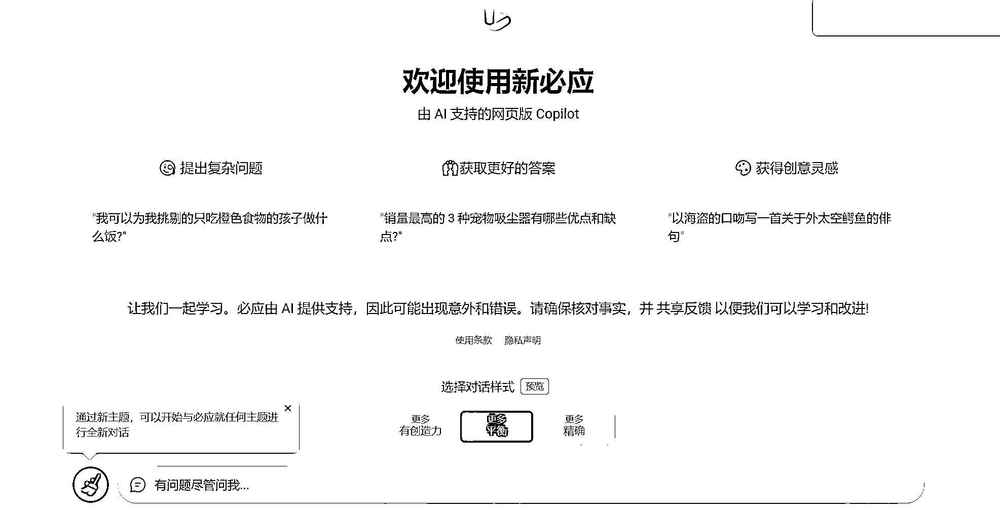

# 微软 Bing，不用梯子就可以在 Chrome 浏览器使用

> 原文：[`www.yuque.com/for_lazy/xkrm14/rtfv3g1hnspaeaeu`](https://www.yuque.com/for_lazy/xkrm14/rtfv3g1hnspaeaeu)

<ne-p id="ub1c82dba" data-lake-id="ub1c82dba"><ne-text id="u3cf276b3">作者： 代码君</ne-text></ne-p> <ne-p id="u62e93387" data-lake-id="u62e93387"><ne-text id="u16f98399">日期：2023-03-21</ne-text></ne-p> <ne-p id="u089b6c7b" data-lake-id="u089b6c7b"><ne-text id="u3e783ac9">点赞数：</ne-text><ne-text id="u4712f0ac" ne-bold="true">14</ne-text></ne-p> <ne-hole id="u09fa0e04" data-lake-id="u09fa0e04"><ne-card data-card-name="hr" data-card-type="block" id="Ni1sQ" data-event-boundary="card"><ne-p id="u9fcb7a22" data-lake-id="u9fcb7a22"><ne-text id="ufd39e5d4">正文：</ne-text></ne-p> <ne-p id="u15eecd68" data-lake-id="u15eecd68"><ne-text id="u87fd603f">微软 bing，把请求头修改一下，不用梯子，就可以在 chrome 浏览器使用 微软 chatgpt new bing 修改请求头</ne-text> <ne-text id="ufbdee43d">^http(s?)://(.</ne-text><ne-text id="u607842fd" ne-italic="true">).bing\.com/(.</ne-text><ne-text id="uaf7627bc">) x-forwarded-for 8.8.8.8 user-agent</ne-text> <ne-text id="ueab80741">Mozilla/5.0 (X11; Linux x86_64) AppleWebKit/537.36 (KHTML, like Gecko)</ne-text> <ne-text id="uf7b9a430">Chrome/110.0.0.0 Safari/537.36 Edg/110.0.1587.41</ne-text></ne-p> <ne-p id="ub7f60b55" data-lake-id="ub7f60b55"><ne-card data-card-name="image" data-card-type="inline" id="A4sF4" data-event-boundary="card">  <ne-p id="uc8590695" data-lake-id="uc8590695"><ne-card data-card-name="image" data-card-type="inline" id="Zbayf" data-event-boundary="card">  <ne-p id="ud65a048d" data-lake-id="ud65a048d"><ne-card data-card-name="image" data-card-type="inline" id="OJyLB" data-event-boundary="card">  <ne-hole id="ued0a1bdd" data-lake-id="ued0a1bdd"><ne-card data-card-name="hr" data-card-type="block" id="pnaZW" data-event-boundary="card"><ne-p id="uce9b35a1" data-lake-id="uce9b35a1"><ne-text id="u8a9e578a">评论区：</ne-text></ne-p> <ne-p id="u18ca542f" data-lake-id="u18ca542f"><ne-text id="uee9787e5">康松 : 现在这招还有用嘛，之前我试过一直 Ref A/B/C 错误</ne-text></ne-p> <ne-hole id="udb1709d6" data-lake-id="udb1709d6"><ne-card data-card-name="hr" data-card-type="block" id="fE5Yd" data-event-boundary="card"><ne-p id="u442cac36" data-lake-id="u442cac36"><ne-text id="u778806f8">公众号懒人找资源，懒人专属群分享</ne-text></ne-p></ne-card></ne-hole></ne-card></ne-hole></ne-card></ne-p></ne-card></ne-p></ne-card></ne-p></ne-card></ne-hole>