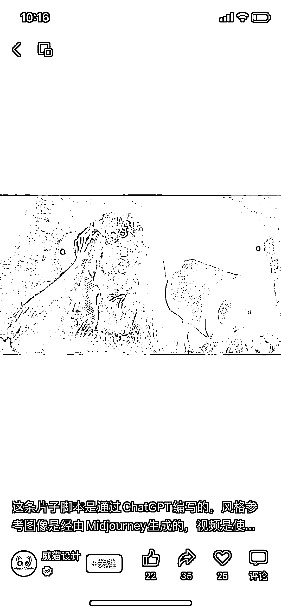

# AI 一条龙创作，从脚本到图像到视频和音乐

> 原文：[`www.yuque.com/for_lazy/xkrm14/mfpx5k8ldvmtwlt7`](https://www.yuque.com/for_lazy/xkrm14/mfpx5k8ldvmtwlt7)

<ne-p id="uc5d185ff" data-lake-id="uc5d185ff"><ne-text id="ufb87df69">作者： 杨永源 CasYang</ne-text></ne-p> <ne-p id="u3a9b044a" data-lake-id="u3a9b044a"><ne-text id="uafd42c5a">日期：2023-03-21</ne-text></ne-p> <ne-p id="ud68834cd" data-lake-id="ud68834cd"><ne-text id="u97aac0c6">点赞数：</ne-text><ne-text id="u4616e83d" ne-bold="true">45</ne-text></ne-p> <ne-hole id="u591276c5" data-lake-id="u591276c5"><ne-card data-card-name="hr" data-card-type="block" id="cOlG1" data-event-boundary="card"><ne-p id="u8f4e6716" data-lake-id="u8f4e6716"><ne-text id="u1e1d6050">正文：</ne-text></ne-p> <ne-p id="u818a629a" data-lake-id="u818a629a"><ne-text id="u1977d181">AI 一条龙创作，从脚本到图像到视频和音乐 chatGPT+Midjourney+Runway Gen+Boomy AI</ne-text> <ne-text id="uf4a4119b">继 AI 模特图之后，应该可以拓展 AI 化视频展示了</ne-text>[<ne-text id="u5631a150">从脚本编写、风格参考、视频生成到背景音乐，这条视频基本全是由 AI 完成的。太强！</ne-text>](https://mp.weixin.qq.com/s/G_GiIlF_GUkId4IZlfHeyA)</ne-p> <ne-p id="u43bd92d4" data-lake-id="u43bd92d4"><ne-card data-card-name="image" data-card-type="inline" id="xAIDK" data-event-boundary="card">  <ne-p id="ue64c0a96" data-lake-id="ue64c0a96"><ne-card data-card-name="image" data-card-type="inline" id="f48XW" data-event-boundary="card">  <ne-hole id="u2c5fae5a" data-lake-id="u2c5fae5a"><ne-card data-card-name="hr" data-card-type="block" id="O0cpu" data-event-boundary="card"><ne-p id="u12d12b28" data-lake-id="u12d12b28"><ne-text id="u854af7c4">评论区：</ne-text></ne-p> <ne-p id="ue3ade8d3" data-lake-id="ue3ade8d3"><ne-text id="u0da07c67">波叔 : 卷筒纸玩出了新高度[强][强]</ne-text></ne-p> <ne-hole id="u01da26e4" data-lake-id="u01da26e4"><ne-card data-card-name="hr" data-card-type="block" id="ur110" data-event-boundary="card"><ne-p id="u4a3c8e73" data-lake-id="u4a3c8e73"><ne-text id="uaff636b3">公众号懒人找资源，懒人专属群分享</ne-text></ne-p></ne-card></ne-hole></ne-card></ne-hole></ne-card></ne-p></ne-card></ne-p></ne-card></ne-hole>