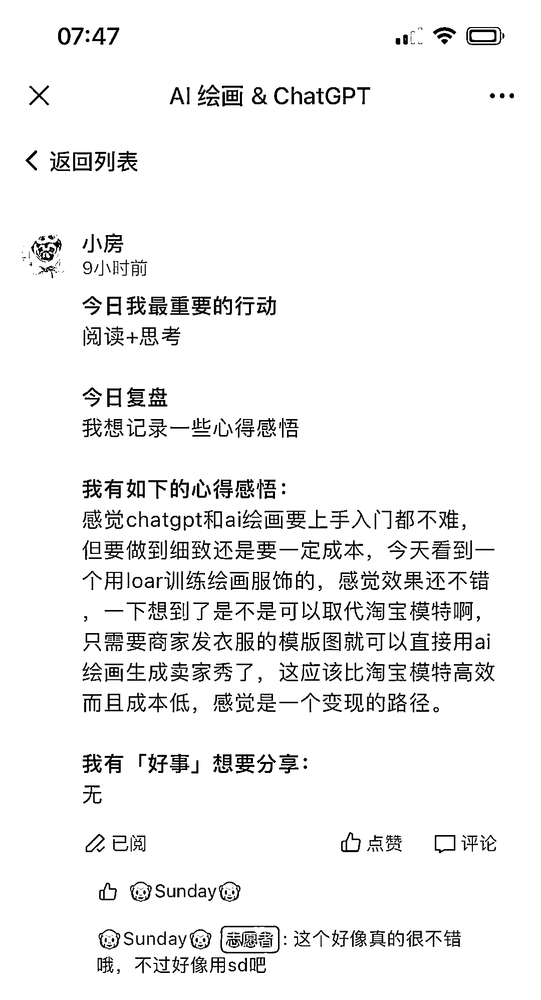
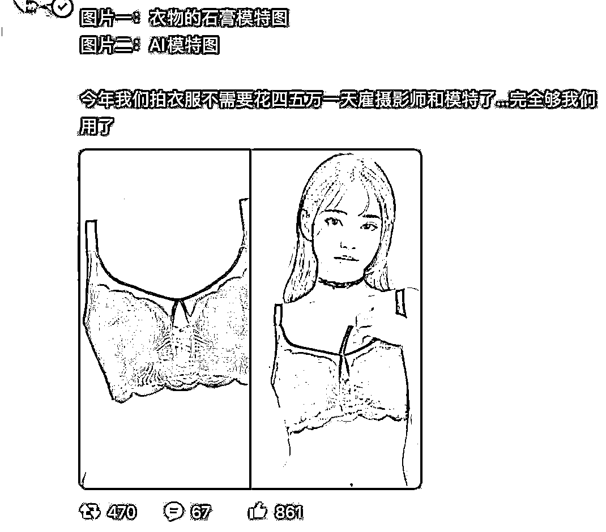

# 帮助淘宝店家用 ChatGPT 和 AI 绘画完成服饰产品的拍摄

> 原文：[`www.yuque.com/for_lazy/xkrm14/eli2skkubftbn2v9`](https://www.yuque.com/for_lazy/xkrm14/eli2skkubftbn2v9)

作者： 🐵Sunday🐵

日期：2023-03-21

点赞数：56

正文：

《帮助淘宝店家用 Chatgpt 和 AI 绘画完成服饰产品的拍摄》 此文计划是根据我们队船员， 的思路作为延展思考🤔 一、背景和市场分析 淘宝作为中国最大的电商平台之一，越来越多的店家开始向网上转型。然而，传统的拍摄方式在成本和效率上面临着一些挑战，而 Chatgpt 和 AI 绘画技术的出现为淘宝店家提供了一种更为便捷、高效、低成本的产品拍摄方式。 据调查，中国的电商市场在近年来增长迅速，但传统拍摄方式所需的费用和时间成本让许多淘宝店家望而却步。此外，对于一些卖场不大、场地狭窄的淘宝店家来说，传统拍摄方式所需的空间和设备也是制约因素。 因此，我们将通过 Chatgpt 和 AI 绘画技术，为淘宝店家提供一种更加便捷、高效、低成本的产品拍摄解决方案。 传统拍摄方式的成本包括： 模特费用：根据模特的知名度和形象，模特费用一般在几百到几千元不等。 场地租赁费用：场地租赁费用因地区而异，通常每小时几百元到几千元不等。 拍摄设备费用：拍摄设备费用包括摄像机、灯光设备、背景布等，根据设备品质和数量不同，费用在数千元至数万元之间。 化妆费用：根据化妆师的知名度和经验，化妆费用一般在几百到几千元不等。 摄影师费用：根据摄影师的知名度和经验，摄影师费用一般在几千元至数万元之间。 后期制作费用：后期制作费用包括修图、剪辑、特效等费用，根据后期制作复杂度和效果不同，费用在数千元至数万元之间。 因此，传统拍摄方式的总成本通常在数万元至数十万元之间，具体费用因不同情况而异。 AI 绘图方式的成本包括： 软件和硬件费用：AI 绘图需要一定的软件和硬件支持，费用在几千元至数万元不等，具体费用因不同情况而异。 AI 技术支持费用：如果需要购买或订阅 AI 技术支持服务，可能需要支付一定的技术支持费用。 人员培训和维护费用：如果店家没有相关技术人员，可能需要花费一定的时间和费用进行人员培训和维护。 因此，AI 绘图方式的总成本相对传统拍摄方式较低，但具体费用因不同情况而异。 二、产品和服务 我们的服务主要包括两部分： Chatgpt 文本生成：我们将利用 Chatgpt 模型，输入相关的文字和描述，自动生成人物模特和服饰的效果图。店家只需要提供相关的文字和描述，即可获得多张服饰产品的效果图。 AI 绘画：我们将利用 AI 绘画技术，为淘宝店家提供高质量的服饰产品效果图。店家只需要提供相关的产品图案和样式，即可获得高质量的效果图。 三、商业模式 基于 AI 绘图方式的商业模式，我们可以提供一个灵活、便捷、高效、低成本的商业模式，主要针对那些预算相对较低、需要频繁拍摄产品的淘宝店家。 我们可以提供一个基于订阅制的商业模式，店家可以根据自己的需求和预算选择不同的订阅方案，包括以下几种： 文本生成订阅：店家可以根据自己的需求，订阅一定数量的 Chatgpt 文本生成服务。我们将根据店家提供的文字和描述，自动生成服饰产品的效果图，并交付给店家。 AI 绘画订阅：店家可以根据自己的需求，订阅一定数量的 AI 绘画服务。店家只需提供相关的产品图案和样式，即可获得高质量的效果图。 组合订阅：店家可以根据自己的需求，订阅以上两种服务的组合。 四、市场推广 我们将通过以下方式进行市场推广： 通过淘宝平台进行推广：在淘宝平台上开设我们的官方店铺，通过线上推广和广告展示等方式进行宣传和推广。 利用社交媒体：通过微信、微博等社交媒体平台进行宣传和推广，与淘宝店家建立合作关系。 口碑推荐：我们将利用客户的口碑推荐来推广我们的服务。 五、竞争对手分析 当前市场上，尚未有类似于我们所提供的 Chatgpt 和 AI 绘画技术的解决方案。我们的技术优势和成本优势可以帮助我们在市场上占据优 以上文案是通过今天用 chatgpt 用了 200 条对话最终形成的商业计划！如有不是太完善的地方，请各位大佬指教。因为目前我还是在 gpt 的 建模中学习，但是我相信，只要努力，每个人都有自己的一个微雕产品！我也很感谢我们船的队友每天为我提供很好的思路进行深挖！ 图片来源， ，@春柏，@麦洛 milo

  

  

  

评论区：

暂无评论

公众号懒人找资源，懒人专属群分享

