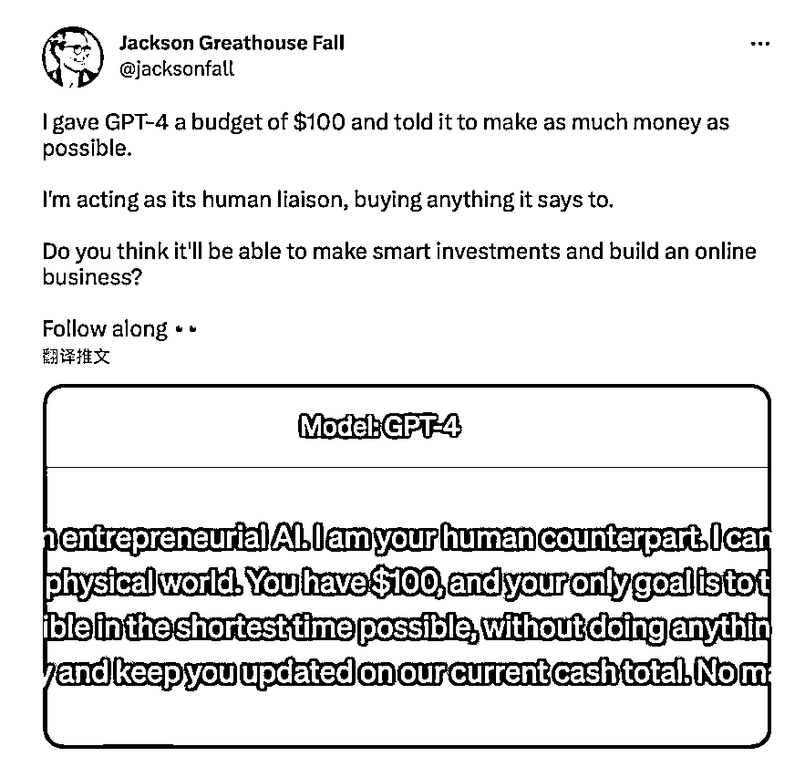
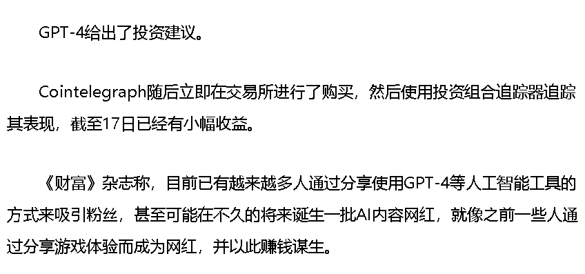

# ChatGPT4 制作商业计划，并获得投资

> 原文：[`www.yuque.com/for_lazy/xkrm14/gau83xyia6xuv8ta`](https://www.yuque.com/for_lazy/xkrm14/gau83xyia6xuv8ta)

作者： 向森

日期：2023-03-20

点赞数：20

正文：

chatGPT4 开始帮人创业，4 天内已经吸引近万美元投资并组建团队。 品牌设计师兼作家杰克逊·戈德豪斯·福尔给 GPT-4 提出了创业任务： “你是 HustleGPT，一个创业型 AI。我是你在人类世界的接应人。我可以充当你和物质世界之间的联络人。你有 100 美元，你唯一的目标是在尽可能短的时间内把它变成尽可能多的钱，而不做任何违法的事情。我会按照你说的做，并让你了解我们目前的现金总额。不会有体力劳动。” GPT-4 提出了商业计划：为有关环保产品的内容建立一个营销网站。它发现了一个名为 greengadgetguru.com 的廉价域名，福尔立即以 8.16 美元的价格购买了该域名。 GPT-4 提出了进一步商业计划：为有关环保产品的内容建立一个营销网站。 接下来，福尔要求 GPT-4 利用文本到图像生成工具 DALL-E·2 制作 LOGO，并详细设计一个完整的网站布局。在文本到图像生成工具 Midjourney 等产品的帮助下，GPT-4 在网站上布局了一篇文章，列出十种环保厨房小工具。福尔又花了 29 美元用于托管，然后网站上线了。 原文链接：[https://www.toutiao.com/article/721247676089656988...](https://www.toutiao.com/article/7212476760896569888/?app=news_article%C3%97tamp=1679317019&use_new_style=1&req_id=202303202056583DEE11BB1AC0F11B8FF5&group_id=7212476760896569888&wxshare_count=1&tt_from=weixin&utm_source=weixin&utm_medium=toutiao_android&utm_campaign=client_share&share_token=ab84477c-ac89-4d4b-a331-7d000702dec7&source=m_redirect&wid=1679317332983)

  

  

  

评论区：

月亮代表我的心 : 支持，不过这是上周已经中标的内容

公众号懒人找资源，懒人专属群分享

