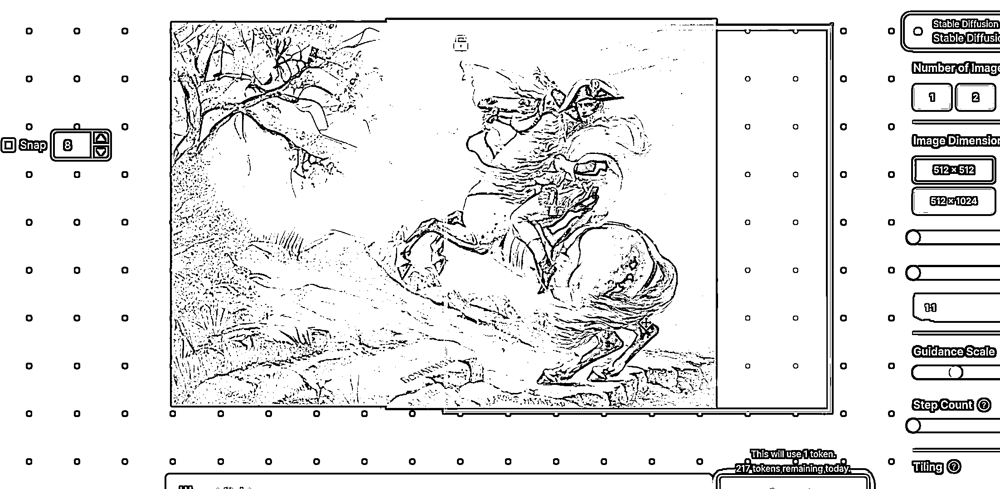
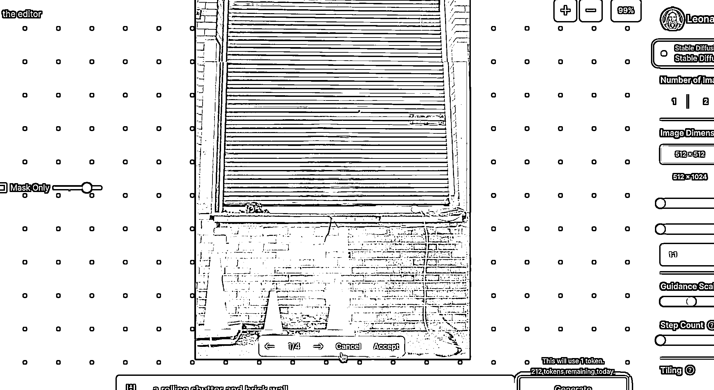

# LeonardoAI，一个新的 AI 绘画工具

> 原文：[`www.yuque.com/for_lazy/xkrm14/tbdz63w6g80pmfuf`](https://www.yuque.com/for_lazy/xkrm14/tbdz63w6g80pmfuf)

作者： 西成歌

日期：2023-03-20

点赞数：33

正文：

LeonardoAI，一个新的 AI 绘画工具，据说有好几个新功能让 Midjourney 也感到害怕 1、创作界面可一键生成 prompts（图 1） 2、给图片一个特定的姿势（图 2） 3、一键延展原图片，一个骑兵变成八个骑兵行不行？（图 3、4） 4、一键抠图、涂鸦任何图案，图案可以输入关键词 AI 生成（图 5、6、7） 5、【重磅】可以单独喂喜欢的风格图片（如宫崎骏）大约十几张图就能让大师为你画图了（此处无图） 这个平台审核大约需要 1 周左右时间，今天刚通过，对白嫖党也很友好，每天可以免费做大约 250 张图，我要迫不及待开始“创作了”

评论区：

鹤 : 哇

浩辰 : 网址多少呢

西成歌 : 刚几个圈友申请，现在秒过了，直接能用[https://app.leonardo.ai/](https://app.leonardo.ai/)

浩辰 : 感谢

苹果哥跑产地 : 汉化的插件可以推荐么

西成歌 : 在有魔法的情况下，谷歌浏览器可以直接网页翻译，我是用的 edge 浏览器，也是网页翻译

苹果哥跑产地 : 谢谢哈

爱米粒 : 感谢[咖啡]

