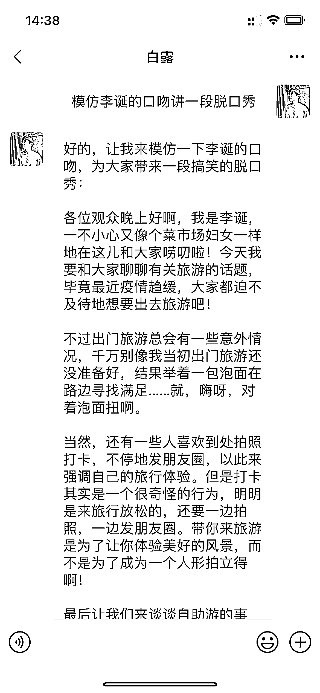

# 自带 ChatGPT 插件的微信版本

> 原文：[`www.yuque.com/for_lazy/xkrm14/wi6vk3e73mu4iswf`](https://www.yuque.com/for_lazy/xkrm14/wi6vk3e73mu4iswf)

<ne-p id="ue20101ed" data-lake-id="ue20101ed"><ne-text id="u202adee0">作者： 白露听雨</ne-text></ne-p> <ne-p id="u8bac5c02" data-lake-id="u8bac5c02"><ne-text id="u73e82722">日期：2023-03-20</ne-text></ne-p> <ne-p id="uf454d5ef" data-lake-id="uf454d5ef"><ne-text id="ue4cbf285">点赞数：</ne-text><ne-text id="u24934997" ne-bold="true">16</ne-text></ne-p> <ne-hole id="u19ac9a9d" data-lake-id="u19ac9a9d"><ne-card data-card-name="hr" data-card-type="block" id="uqT4h" data-event-boundary="card"><ne-p id="uf5652bd3" data-lake-id="uf5652bd3"><ne-text id="u7a921f66">正文：</ne-text></ne-p> <ne-p id="u1a00b9bf" data-lake-id="u1a00b9bf"><ne-text id="u0f03c2a9">自带 chatgpt 插件的微信版本，配合签名，自行安装，算是小白微信接入 chatgpt 比较方便的方法 签名方法 插件微信版本 链接: 提取码:</ne-text> <ne-text id="udde9a1ee">f5f4</ne-text>[<ne-text id="ub40a72b9">https://t.zsxq.com/0crQQ79lb</ne-text>](https://t.zsxq.com/0crQQ79lb) [<ne-text id="u67b5f943">百度网盘+请输入提取码</ne-text>](https://pan.baidu.com/s/1jY-fEwcvNCU_CvJFXZ_6Lw?pwd=f5f4)</ne-p> <ne-p id="u1ed5e9aa" data-lake-id="u1ed5e9aa"><ne-card data-card-name="image" data-card-type="inline" id="Si1dG" data-event-boundary="card"></ne-card></ne-p> <ne-p id="ua4a72974" data-lake-id="ua4a72974"><ne-card data-card-name="image" data-card-type="inline" id="XUS7V" data-event-boundary="card"></ne-card></ne-p> <ne-hole id="u7cfc7bd3" data-lake-id="u7cfc7bd3"><ne-card data-card-name="hr" data-card-type="block" id="IEgcA" data-event-boundary="card"><ne-p id="u5e9fe200" data-lake-id="u5e9fe200"><ne-text id="u70342dac">评论区：</ne-text></ne-p> <ne-p id="u4c3debc8" data-lake-id="u4c3debc8"><ne-text id="uc398b8d7">浅色 8ug 的喵 : 给不太懂的圈友一个温馨提示： 1、需要网络环境或返代链接。 2、新号和最近有违规的号尽量不要用，有封号几率。</ne-text></ne-p> <ne-hole id="u2bfa87de" data-lake-id="u2bfa87de"><ne-card data-card-name="hr" data-card-type="block" id="RYyfc" data-event-boundary="card"><ne-p id="u57d6715c" data-lake-id="u57d6715c"><ne-text id="u04c958f9">公众号懒人找资源，懒人专属群分享</ne-text></ne-p></ne-card></ne-hole></ne-card></ne-hole></ne-card></ne-hole>