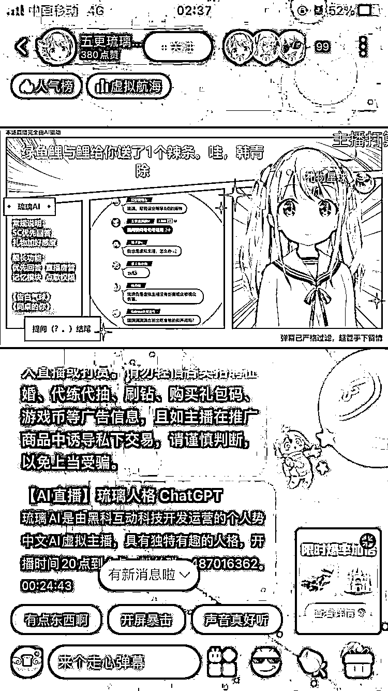

# ChatGPT AI 直播，礼物问题优先回复拥有额外权限

> 原文：[`www.yuque.com/for_lazy/xkrm14/eylav8g6iekobrgs`](https://www.yuque.com/for_lazy/xkrm14/eylav8g6iekobrgs)

<ne-p id="ua6c072e6" data-lake-id="ua6c072e6"><ne-text id="u9da0f6cc">作者： 马小远</ne-text></ne-p> <ne-p id="u2c4ca181" data-lake-id="u2c4ca181"><ne-text id="ucc4f85c8">日期：2023-03-20</ne-text></ne-p> <ne-p id="uafc0968a" data-lake-id="uafc0968a"><ne-text id="u8d1031e3">点赞数：</ne-text><ne-text id="ud39f4560" ne-bold="true">7</ne-text></ne-p> <ne-hole id="u61606be1" data-lake-id="u61606be1"><ne-card data-card-name="hr" data-card-type="block" id="N67vI" data-event-boundary="card"><ne-p id="u3cbcb9ee" data-lake-id="u3cbcb9ee"><ne-text id="u68f8d104">正文：</ne-text></ne-p> <ne-p id="u81193451" data-lake-id="u81193451"><ne-text id="u81c3c9aa">ChatGPT AI 直播，礼物问题优先回复，同时对于舰长（类似长期金主）拥有额外权限。 观看了 10 分钟左右，弹幕互动提问热度很高，主播应该是通过 ai</ne-text> <ne-text id="u0d727c9b">语音接口对 chatGPT 文字转语音回复，机械音很重。 风险点：可能有弹幕会提问一些风险问题，需要有人关注弹幕和回答内容。</ne-text></ne-p> <ne-p id="u969fa7e0" data-lake-id="u969fa7e0"><ne-card data-card-name="image" data-card-type="inline" id="AQv4r" data-event-boundary="card"></ne-card></ne-p> <ne-hole id="u141823ef" data-lake-id="u141823ef"><ne-card data-card-name="hr" data-card-type="block" id="BUBVh" data-event-boundary="card"><ne-p id="u6a74ec46" data-lake-id="u6a74ec46"><ne-text id="uab6ae637">评论区：</ne-text></ne-p> <ne-p id="u134fe572" data-lake-id="u134fe572"><ne-text id="ub97eac3d">暂无评论</ne-text></ne-p> <ne-hole id="u29feb976" data-lake-id="u29feb976"><ne-card data-card-name="hr" data-card-type="block" id="ruZRH" data-event-boundary="card"><ne-p id="u3bb0754c" data-lake-id="u3bb0754c"><ne-text id="uc3bcd8d4">公众号懒人找资源，懒人专属群分享</ne-text></ne-p></ne-card></ne-hole></ne-card></ne-hole></ne-card></ne-hole>