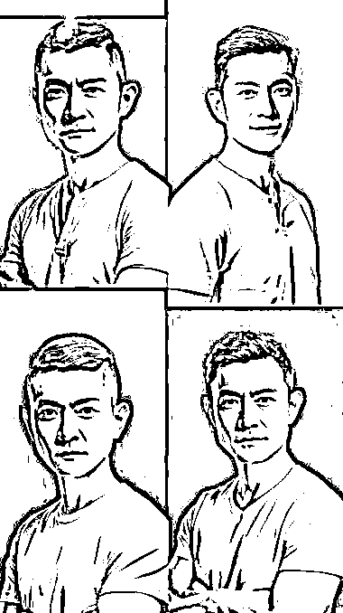
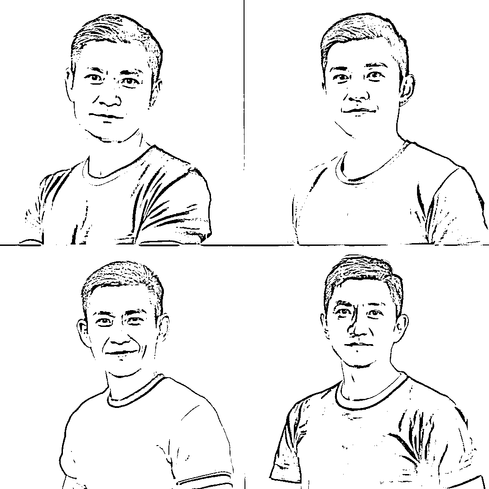

# Stable Diffusion，摄影馆用以前拍的图训练一个模型

> 原文：[`www.yuque.com/for_lazy/xkrm14/bczpmaf9cm98d223`](https://www.yuque.com/for_lazy/xkrm14/bczpmaf9cm98d223)

<ne-p id="u399afdf6" data-lake-id="u399afdf6"><ne-text id="u5e44fef6">作者： 陈思成</ne-text></ne-p> <ne-p id="u12aa0124" data-lake-id="u12aa0124"><ne-text id="uaba26f20">日期：2023-03-20</ne-text></ne-p> <ne-p id="u5c625e6d" data-lake-id="u5c625e6d"><ne-text id="u6397b607">点赞数：</ne-text><ne-text id="u67b084a9" ne-bold="true">24</ne-text></ne-p> <ne-hole id="u73e72764" data-lake-id="u73e72764"><ne-card data-card-name="hr" data-card-type="block" id="hvNEf" data-event-boundary="card"><ne-p id="udd06effb" data-lake-id="udd06effb"><ne-text id="ua7e22278">正文：</ne-text></ne-p> <ne-p id="u87ea999a" data-lake-id="u87ea999a"><ne-text id="u97d2f04f">Stable</ne-text> <ne-text id="u49e3a9e3">Diffusion，摄影馆用以前拍的图训练一个模型，是不是可以开设新业务了，云摄像馆，新客户提供一些照片，训练一个 LoRA 就可以出各种形象照？[偷笑]</ne-text></ne-p> <ne-p id="u1dc86a9e" data-lake-id="u1dc86a9e"><ne-card data-card-name="image" data-card-type="inline" id="el51U" data-event-boundary="card"></ne-card></ne-p> <ne-p id="u9f6435bf" data-lake-id="u9f6435bf"><ne-card data-card-name="image" data-card-type="inline" id="rPoq2" data-event-boundary="card"></ne-card></ne-p> <ne-p id="u936f428b" data-lake-id="u936f428b"><ne-card data-card-name="image" data-card-type="inline" id="SIbdX" data-event-boundary="card"></ne-card></ne-p> <ne-p id="ue9c69902" data-lake-id="ue9c69902"><ne-card data-card-name="image" data-card-type="inline" id="pSecx" data-event-boundary="card"></ne-card></ne-p> <ne-hole id="ud29af179" data-lake-id="ud29af179"><ne-card data-card-name="hr" data-card-type="block" id="Ip9bX" data-event-boundary="card"><ne-p id="ucfde79dd" data-lake-id="ucfde79dd"><ne-text id="u8eff425f">评论区：</ne-text></ne-p> <ne-p id="uf55a2eae" data-lake-id="uf55a2eae"><ne-text id="ua619cb1a">暂无评论</ne-text></ne-p> <ne-hole id="u3e46a035" data-lake-id="u3e46a035"><ne-card data-card-name="hr" data-card-type="block" id="CL3p4" data-event-boundary="card"><ne-p id="uc7419bcc" data-lake-id="uc7419bcc"><ne-text id="u79903b38">公众号懒人找资源，懒人专属群分享</ne-text></ne-p></ne-card></ne-hole></ne-card></ne-hole></ne-card></ne-hole>