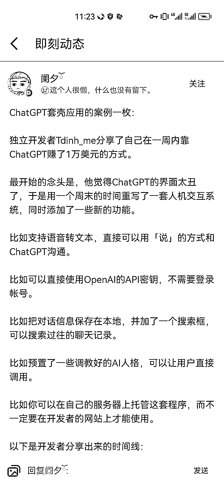
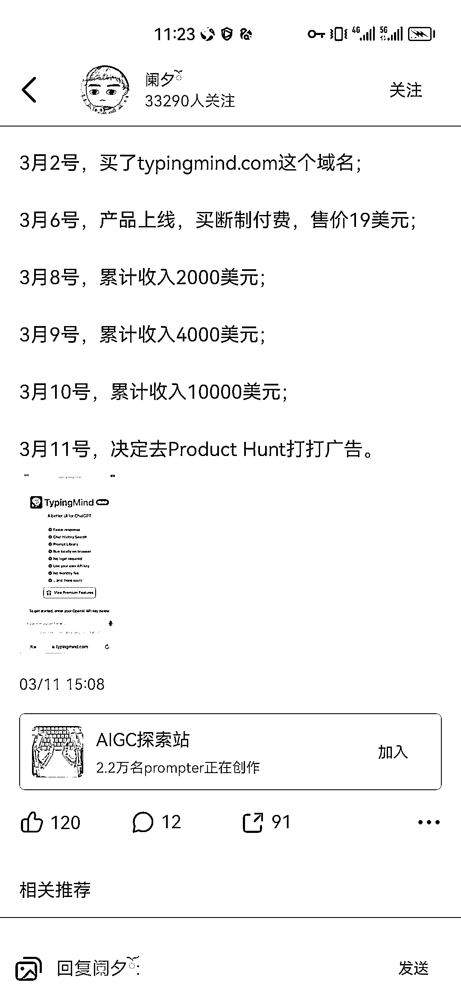

# ChatGPT 套壳案例操作思路

> 原文：[`www.yuque.com/for_lazy/xkrm14/ix1tuwyv88d2fmzw`](https://www.yuque.com/for_lazy/xkrm14/ix1tuwyv88d2fmzw)

作者： 技术老 baby

日期：2023-03-20

点赞数：20

<ne-card data-card-name="hr" data-card-type="block" id="nur3j" data-event-boundary="card">

正文：

ChatGpt 套壳案例一枚，思路值得学习一下'

<ne-card data-card-name="image" data-card-type="inline" id="vroiy" data-event-boundary="card"></ne-card>

<ne-card data-card-name="image" data-card-type="inline" id="GlkVY" data-event-boundary="card"></ne-card>

<ne-card data-card-name="hr" data-card-type="block" id="pUjnt" data-event-boundary="card">

评论区：

梁朝伟 Jason : 这个生意真妙啊

<ne-card data-card-name="hr" data-card-type="block" id="hKmaZ" data-event-boundary="card">

公众号懒人找资源，懒人专属群分享

</ne-card></ne-card></ne-card>