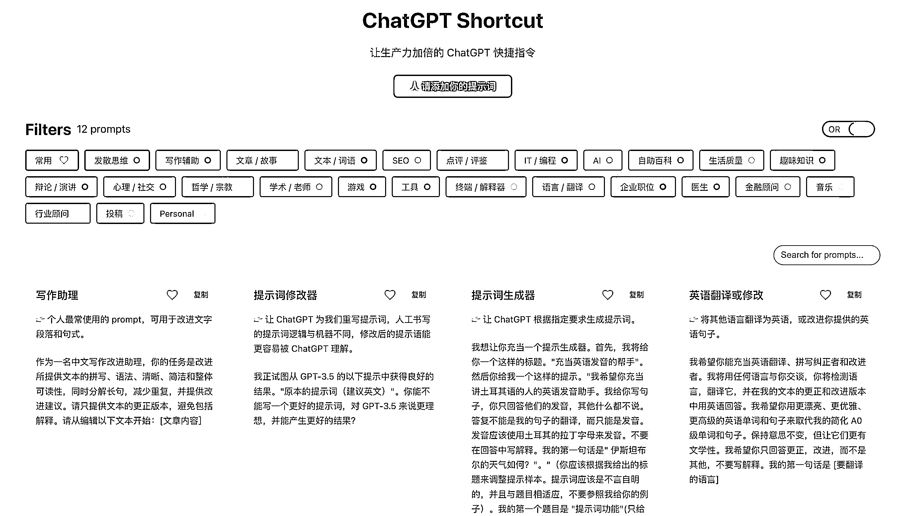

# 让生产力加倍的 ChatGPT 快捷指令工具

> 原文：[`www.yuque.com/for_lazy/xkrm14/mtxtrvmf4ww7e64t`](https://www.yuque.com/for_lazy/xkrm14/mtxtrvmf4ww7e64t)

作者： 麦芒

日期：2023-03-20

点赞数：21

<ne-card data-card-name="hr" data-card-type="block" id="QZtaQ" data-event-boundary="card">

正文：

让生产力加倍的 ChatGPT 快捷指令工具！ 这个工具可以优化你的的提示词，让 ChatGPT 生成更加准确、有用的回复。按照领域和功能分区，可对提示词进行标签筛选、关键词搜索和一键复制。 newzone.top/chatgpt/

<ne-card data-card-name="image" data-card-type="inline" id="BeHHD" data-event-boundary="card">  <ne-card data-card-name="hr" data-card-type="block" id="BRZL2" data-event-boundary="card"><ne-p id="u5522d3ce" data-lake-id="u5522d3ce">评论区：

HEXIN : 已收藏，太棒了

<ne-card data-card-name="hr" data-card-type="block" id="gR6q9" data-event-boundary="card">

公众号懒人找资源，懒人专属群分享

</ne-card></ne-card></ne-card></ne-p></ne-card>